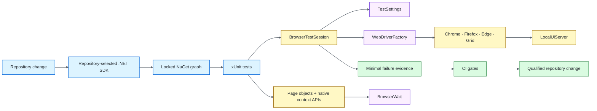

# .NET / Selenium Quality Engineering Framework

[](https://github.com/portyu9/qa-automation-dotnet-selenium/actions/workflows/ci.yml)
[](https://github.com/portyu9/qa-automation-dotnet-selenium/actions/workflows/extended.yml)
[](https://github.com/portyu9/qa-automation-dotnet-selenium/actions/workflows/security.yml)
[](https://github.com/portyu9/qa-automation-dotnet-selenium/actions/workflows/docs.yml)

[](https://dotnet.microsoft.com/)
[](https://xunit.net/)
[](https://www.selenium.dev/)
[](https://www.google.com/chrome/)
[](https://www.mozilla.org/firefox/)
[](https://github.com/features/actions)
[](https://trivy.dev/)
[](LICENSE)
[](.github/SECURITY.md)

A C# browser quality-engineering framework built on **.NET LTS, xUnit, and Selenium WebDriver**. Runtime selection, dependency resolution, deterministic application ownership, driver/session lifecycle, synchronization, browser contexts, evidence, and teardown each have an explicit owner while native WebDriver behavior remains visible.

> [!IMPORTANT]
> Required browser CI is independent of public demonstration sites. The default application is a repository-owned C# loopback fixture; deployed applications and Selenium Grid are explicit execution choices rather than hidden dependencies.

**Start here:** [capabilities](#capabilities) · [architecture](#architecture) · [quick-start](#quick-start) · [repository-map](#repository-map) · [documentation](#documentation)

## Capabilities

| Plane | Purpose | Primary evidence |
| --- | --- | --- |
| Framework contract | Configuration, lifecycle, waits, artifact safety | xUnit + coverage |
| Primary browser | Authentication/navigation/context behavior | Chrome + TRX/Cobertura/browser evidence |
| Native browser primitives | JavaScript, cookies, frames, alerts, child-window lifecycle | WebDriver/xUnit assertions |
| Extended browser | Engine compatibility | Chrome + Firefox |
| Remote execution | Driver-location portability | Optional Selenium Grid |
| Dependency integrity | Exact NuGet graph + advisory policy | Locked restore/build |
| Security | C# SAST, repository/dependency/configuration/secret, dependency-diff risk | CodeQL, NuGet Audit, Trivy, Dependency Review |
| Documentation | README/workflow/governance consistency | Documentation contract status |

## Architecture



xUnit owns test/fixture lifetime, Selenium owns browser semantics, framework services own configuration/driver/wait/evidence policy, and the local application remains repository-owned. See [`docs/ARCHITECTURE.md`](docs/ARCHITECTURE.md) for deeper ownership boundaries.

## Quick start

Prerequisites are the SDK selected by `global.json` and a supported local browser. Selenium Manager resolves compatible local driver binaries.

```bash
dotnet restore UiTests.csproj --locked-mode
dotnet build UiTests.csproj --configuration Release --no-restore
dotnet test UiTests.csproj --configuration Release --no-build
```

Compatibility/integration examples:

```bash
TEST_BROWSER=firefox dotnet test UiTests.csproj
TEST_BASE_URL=https://test.example.internal TEST_BROWSER=chrome dotnet test UiTests.csproj
TEST_BROWSER=chrome SELENIUM_GRID_URL=http://localhost:4444/wd/hub dotnet test UiTests.csproj
```

For runtime variables, browser lifecycle, native context primitives, synchronization, Grid policy, evidence, security, dependencies, and triage, see [`docs/OPERATIONS.md`](docs/OPERATIONS.md).

## Repository map

```text
.
├── .github/
├── docs/
├── Framework/
├── PageObjects/
└── Tests/
```

## Engineering contracts

- **Pinned toolchain:** `global.json` selects the repository SDK and required automation restores `packages.lock.json` in `--locked-mode`.
- **Fail-closed advisories:** HIGH/CRITICAL NuGet advisories are build-breaking; warnings/analyzer findings are errors.
- **Deterministic target:** required browser gates use the repository-owned `http://127.0.0.1:3200` fixture.
- **Single driver boundary:** tests do not construct WebDrivers directly; `WebDriverFactory` owns local/Grid construction policy.
- **One session owner:** one xUnit test instance owns one WebDriver and deterministic teardown.
- **Observable synchronization:** implicit wait remains zero; explicit waits describe browser/application state rather than elapsed time.
- **Explicit context ownership:** frames, alerts, cookies, JavaScript, and child windows use native WebDriver semantics with restoration/cleanup where context changes.
- **Minimal evidence:** automatic capture is sanitized URL + screenshot; page source is explicit opt-in because it can contain hidden sensitive data.
- **Separate Grid/integration:** browser transport location and deployed application state remain independent failure domains.

## Quality gates

| Gate | Responsibility |
| --- | --- |
| [`ci.yml`](.github/workflows/ci.yml) | Exact SDK, locked/audited restore, build, deterministic Chrome, TRX/Cobertura/browser evidence |
| [`extended.yml`](.github/workflows/extended.yml) | Chrome/Firefox compatibility under the same dependency/build contract |
| [`security.yml`](.github/workflows/security.yml) | CodeQL, locked NuGet audit, Trivy, Dependency Review when available |
| [`docs.yml`](.github/workflows/docs.yml) | README links, badges, Mermaid, repository-map, documentation governance |

The workflows expose stable aggregate jobs `ci-gate`, `extended-gate`, and `security-gate`; repository rules/settings are a separate governance layer.

## Documentation

| Guide | Use it for |
| --- | --- |
| [`docs/ARCHITECTURE.md`](docs/ARCHITECTURE.md) | Runtime/dependency, fixture, driver, session, synchronization, evidence, security boundaries |
| [`docs/TEST_STRATEGY.md`](docs/TEST_STRATEGY.md) | Deterministic targets, browser matrix, negative testing, security gates, exit criteria |
| [`docs/OPERATIONS.md`](docs/OPERATIONS.md) | Commands, runtime config, **browser lifecycle diagram**, context APIs, waits, Grid, evidence, supply chain, triage |
| [`CONTRIBUTING.md`](CONTRIBUTING.md) | Change-quality expectations |

The deeper browser-lifecycle flow and operating detail live in `/docs`; the main README intentionally retains only the architecture diagram above.

## Design principle

Prefer the **lowest-cost boundary that contributes the semantics under test**. A strong Selenium framework makes the failing boundary obvious: **toolchain, dependency graph, security policy, configuration, fixture lifecycle, browser construction, browser-context ownership, synchronization, application behavior, evidence, Grid transport, or deployed environment**.
