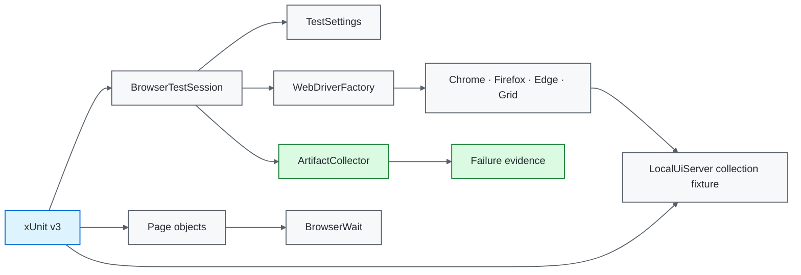
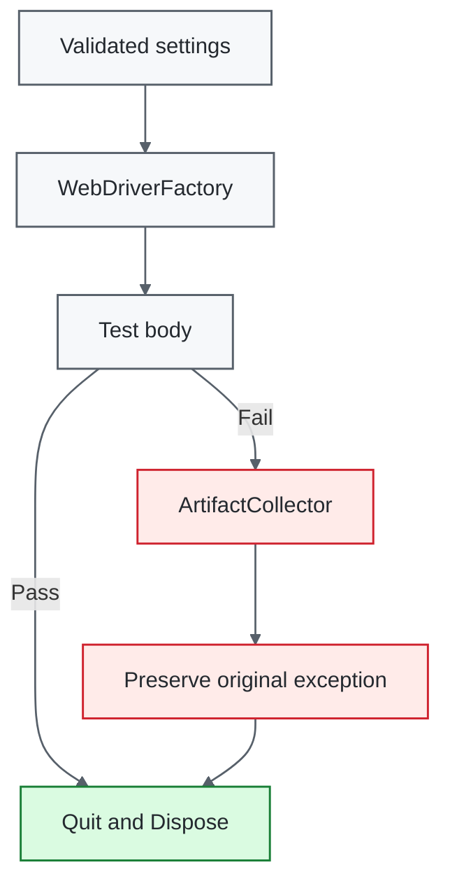

# .NET / Selenium Quality Engineering Framework

[](https://github.com/portyu9/qa-automation-dotnet-selenium/actions/workflows/ci.yml)
[](https://github.com/portyu9/qa-automation-dotnet-selenium/actions/workflows/extended.yml)
[](https://github.com/portyu9/qa-automation-dotnet-selenium/actions/workflows/security.yml)
[](https://github.com/portyu9/qa-automation-dotnet-selenium/actions/workflows/docs.yml)

[](https://dotnet.microsoft.com/)
[](https://xunit.net/)
[](https://www.selenium.dev/)
[](https://www.google.com/chrome/)
[](https://www.mozilla.org/firefox/)
[](https://github.com/features/actions)
[](https://trivy.dev/)
[](LICENSE)
[](.github/SECURITY.md)

A C# browser quality-engineering framework built on **xUnit v3**, **Selenium WebDriver**, and .NET 8. It treats configuration, browser construction, deterministic application ownership, synchronization, evidence capture, and teardown as explicit boundaries while keeping native WebDriver semantics visible.

> [!IMPORTANT]
> Required browser CI is independent of public demonstration sites. The default application target is a repository-owned loopback fixture implemented in C#. A deployed application or Selenium Grid remains an explicit configuration choice, not a prerequisite for framework correctness.

## Capability map

| Plane | What it proves | Execution | Evidence |
| --- | --- | --- | --- |
| Framework contract | Configuration and artifact safety | xUnit v3 / .NET 8 | Assertions + coverage |
| Primary browser | Browser/session + authentication behavior | Chrome / local fixture | TRX, Cobertura, browser artifacts |
| Extended browser | Engine compatibility | Chrome + Firefox / local fixture | Per-browser evidence |
| Remote execution | Driver-location portability | Optional Selenium Grid | Same page/test surface |
| Security | Dependency/configuration exposure | Trivy filesystem scan | JSON + Markdown findings |
| Documentation | README/workflow/governance consistency | Repository-local validator | Actions status |
| Observability | Run/gate identity | CI envelope + correlation | `artifacts/ci/` + Actions summary |



## Engineering invariants

| Concern | Framework contract |
| --- | --- |
| Default target | `http://127.0.0.1:3200` is the deterministic browser target. |
| Fixture ownership | `LocalUiServer` is a C# xUnit collection fixture; no Node/Python helper runtime is introduced. |
| External integration | A non-default `TEST_BASE_URL` is explicit and classified separately from required CI. |
| Runtime inputs | `TestSettings` validates values before WebDriver creation. |
| Browser construction | `WebDriverFactory` is the single local/Grid construction boundary. |
| Synchronization | Implicit wait is zero; explicit waits observe visible/clickable/document/URL state. |
| Isolation | One xUnit test instance owns one WebDriver session. |
| Negative behavior | Invalid authentication is a required executable contract. |
| Failure evidence | Evidence is captured before teardown without masking the primary exception. |
| Artifact safety | Run/test path material is constrained and diagnostic URLs are sanitized. |
| Reproducibility | .NET 8 is constrained by `global.json`; package versions are explicit. |
| CI safety | Read-only workflow permissions, concurrency cancellation, and bounded job time are enforced. |

## Tool ownership model

| Tool / technology | Native responsibility | Framework responsibility |
| --- | --- | --- |
| xUnit v3 | Discovery, assertions, fixture/instance lifecycle, scheduling | Collection-owned local UI lifecycle and framework contracts |
| Selenium WebDriver | Browser protocol, navigation, elements, local/remote sessions | One driver factory, browser policy, deterministic cleanup |
| Selenium Manager | Local browser-driver resolution | Used only through `WebDriverFactory` |
| `WebDriverWait` | Bounded condition polling | Observable synchronization policy |
| .NET networking | TCP/stream primitives | Minimal loopback HTTP fixture for deterministic browser contracts |
| Chrome / Firefox / Edge | Browser-engine behavior | Primary/extended/local policy |
| RemoteWebDriver / Grid | Remote command transport | Optional endpoint configuration with the same page/test layer |
| GitHub Actions | Scheduling and artifacts | Gate separation, correlation, bounded execution |
| Trivy | Supported vulnerability/misconfiguration analysis | HIGH/CRITICAL remediation gate |

## Repository map

```text
.
├── Framework/
│   ├── Configuration/TestSettings.cs
│   ├── Diagnostics/ArtifactCollector.cs
│   ├── Drivers/WebDriverFactory.cs
│   ├── Execution/BrowserTestSession.cs
│   ├── Synchronization/BrowserWait.cs
│   └── Testing/LocalUiServer.cs
├── PageObjects/
│   ├── BasePage.cs
│   ├── LoginPage.cs
│   └── HomePage.cs
├── Tests/
│   ├── Fixtures/LocalUiCollection.cs
│   ├── Framework/
│   └── LoginTests.cs
├── docs/
│   ├── ARCHITECTURE.md
│   └── TEST_STRATEGY.md
├── .github/
│   ├── CODEOWNERS
│   ├── SECURITY.md
│   ├── pull_request_template.md
│   ├── scripts/validate_readme.py
│   └── workflows/
├── CONTRIBUTING.md
├── global.json
└── UiTests.csproj
```

## Quick start

Prerequisites are a compatible .NET 8 SDK plus Chrome, Firefox, or Edge. The default test run starts the repository-owned application fixture automatically through xUnit collection lifecycle.

```bash
dotnet restore UiTests.csproj
dotnet build UiTests.csproj --configuration Release
dotnet test UiTests.csproj --configuration Release --no-build
```

Run Firefox against the same deterministic fixture:

```bash
TEST_BROWSER=firefox dotnet test UiTests.csproj
```

Run against an explicitly selected deployed environment:

```bash
TEST_BASE_URL=https://test.example.internal \
TEST_BROWSER=chrome \
dotnet test UiTests.csproj
```

Run through Grid:

```bash
TEST_BROWSER=chrome \
SELENIUM_GRID_URL=http://localhost:4444/wd/hub \
dotnet test UiTests.csproj
```

## Runtime configuration

`Framework/Configuration/TestSettings.cs` is the single environment-parsing boundary.

| Variable | Purpose | Default |
| --- | --- | --- |
| `TEST_BASE_URL` | Browser application target | `http://127.0.0.1:3200` |
| `TEST_BROWSER` | `chrome`, `firefox`, or `edge` | `chrome` |
| `TEST_HEADLESS` | Browser headless mode | `true` |
| `TEST_EXPLICIT_WAIT_SECONDS` | Explicit wait budget | `10` |
| `TEST_PAGE_LOAD_TIMEOUT_SECONDS` | Page-load budget | `30` |
| `SELENIUM_GRID_URL` | Optional remote WebDriver endpoint | unset |
| `TEST_RUN_ID` | Run/artifact correlation | generated GUID |

HTTP(S) URLs must be absolute and may not contain user-info, query strings, or fragments. Browser names are allowlisted, duration budgets must be positive, and supplied run IDs must satisfy the bounded correlation-token contract.

Framework configuration tests inject a read-only lookup instead of mutating process environment. This keeps invalid-configuration tests parallel-safe while browser constructors read the real process environment.

## Deterministic application fixture

`Framework/Testing/LocalUiServer.cs` implements the smallest application needed to prove browser-framework behavior using .NET networking primitives only. It binds loopback port `3200` and serves:

- `/health` — fixture readiness;
- `/` — authentication form;
- `/inventory.html` — successful-authentication destination.

The fixture exercises real browser navigation, DOM interaction, JavaScript form behavior, URL transition, success state, and rejection state without public DNS, TLS, external accounts, rate limits, or third-party uptime.

`Tests/Fixtures/LocalUiCollection.cs` owns one server for the browser-test collection. The browser test class receives that fixture before constructing its WebDriver session, guaranteeing the default target exists before navigation begins.

The fixture is intentionally application-specific and small. It should not become a general web framework.

## Authentication contract

The browser layer verifies both sides of the boundary:

1. `standard_user` / `secret_sauce` reaches `/inventory.html` and the inventory container;
2. invalid credentials remain on `/` and expose `Invalid username or password`.

These values are synthetic fixture data. Deployed-environment credentials should come from environment-specific secure configuration and should never be committed or added to generic evidence.

## Browser lifecycle

`BrowserTestSession` owns one driver from construction through evidence and cleanup:



Evidence/cleanup failure remains secondary diagnostic information. It cannot replace the causal browser/assertion failure.

## Driver policy

`WebDriverFactory` supports Chrome, Firefox, Edge, and optional `RemoteWebDriver`. Common policy includes zero implicit wait, bounded page-load timeout, deterministic viewport, headless configuration, and Selenium Manager for local resolution.

Tests must not construct drivers directly; multiple construction paths cause capability, timeout, and Grid behavior to drift.

## Synchronization model

`BrowserWait` centralizes observable synchronization such as visible/clickable elements, document readiness, and URL transition. Fixed sleeps and mixed implicit/explicit wait models are prohibited.

```csharp
Wait.UntilVisible(By.Id("inventory_container"));
```

The resulting timeout tells which state did not become true, unlike elapsed-time sleeps.

## Page-object boundary

Page objects own feature-specific navigation, selectors, and operations. They do not rename every Selenium command.

```csharp
loginPage.Navigate();
loginPage.Login(username, password);
Assert.True(homePage.IsLoaded);
```

Native `IWebDriver`, `By`, and Selenium exceptions remain visible where they are the clearest diagnostic surface.

## Evidence and privacy

On failure, `ArtifactCollector` writes evidence under a bounded run/test-owned path. Diagnostic URL output strips credentials, query strings, and fragments before persistence.

Screenshots and page source may still contain application-visible data. Use synthetic/controlled data and bounded retention; structured URL redaction does not sanitize pixels or arbitrary DOM content.

## CI topology

Primary CI builds and runs the suite in headless Chrome against the local fixture with TRX and XPlat coverage. Extended CI executes Chrome and Firefox independently against the same deterministic contract.

Every browser job has:

- `contents: read` permissions;
- concurrency cancellation for superseded runs;
- bounded runtime;
- run correlation;
- retained TRX/coverage/browser evidence;
- an explicitly identified local target in the CI summary.

A deployed-environment run should be a separate integration signal rather than replacing this deterministic gate.

## Grid policy

Grid changes browser location/transport, not test architecture. Page/test code should not branch merely because a session is remote. Grid availability and capability negotiation are separate failure domains from application behavior.

## Failure classification

| Signal | First interpretation |
| --- | --- |
| Configuration contract | Framework input policy |
| Fixture startup/connection | Repository fixture lifecycle/port ownership |
| Driver creation | Browser/Selenium Manager/Grid runtime |
| Explicit-wait timeout | Expected state was not observed |
| Authentication rejection mismatch | Application rejection/error semantics |
| Assertion | Browser-visible contract mismatch |
| Evidence failure | Secondary diagnostic issue |
| Teardown failure | Session/infrastructure cleanup |
| Browser-specific failure | Compatibility |
| External-target-only failure | Environment/integration first |

## Security and documentation governance

`.github/workflows/security.yml` preserves Trivy findings for supported dependency/misconfiguration risks. `.github/workflows/docs.yml` validates repository-local README links, badges, Mermaid declarations, governance files, and palette constraints.

Contribution and change-quality expectations live in [`CONTRIBUTING.md`](CONTRIBUTING.md); repository ownership is explicit in [`.github/CODEOWNERS`](.github/CODEOWNERS).

## Extension rules

When adding browser behavior:

1. place the requirement at the lowest layer that can prove it;
2. keep required CI deterministic and repository-owned;
3. add fixture behavior only when browser interaction truly needs it;
4. keep driver construction in `WebDriverFactory`;
5. use observable waits rather than elapsed time;
6. keep one clear session/evidence owner;
7. add negative coverage when rejection semantics matter;
8. classify deployed-environment tests separately;
9. preserve evidence privacy and original-exception integrity.

## Explicit anti-patterns

- required CI against a public demonstration website;
- direct driver construction in tests;
- shared/static WebDriver state;
- `Thread.Sleep` readiness;
- non-zero implicit waits combined with explicit waits;
- evidence exceptions masking test failures;
- process-global environment mutation in configuration contract tests;
- credentials/query tokens persisted in generic diagnostics;
- expanding browser matrices without compatibility risk.

## Design references

- [`docs/ARCHITECTURE.md`](docs/ARCHITECTURE.md) — settings, fixture, driver, session, page, synchronization, and evidence boundaries.
- [`docs/TEST_STRATEGY.md`](docs/TEST_STRATEGY.md) — layer selection, deterministic target policy, browser matrix, negative testing, and exit criteria.

A strong Selenium framework makes the failing boundary obvious: configuration, fixture lifecycle, browser construction, synchronization, application behavior, evidence, Grid transport, or deployed environment.