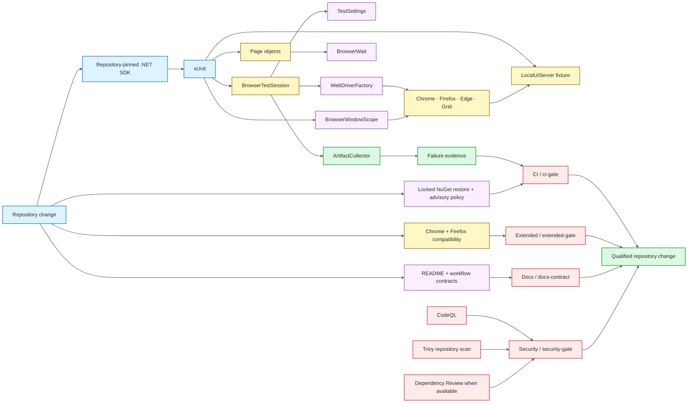

# .NET / Selenium Quality Engineering Framework

[](https://github.com/portyu9/qa-automation-dotnet-selenium/actions/workflows/ci.yml)
[](https://github.com/portyu9/qa-automation-dotnet-selenium/actions/workflows/extended.yml)
[](https://github.com/portyu9/qa-automation-dotnet-selenium/actions/workflows/security.yml)
[](https://github.com/portyu9/qa-automation-dotnet-selenium/actions/workflows/docs.yml)

[](https://dotnet.microsoft.com/)
[](https://xunit.net/)
[](https://www.selenium.dev/)
[](https://www.google.com/chrome/)
[](https://www.mozilla.org/firefox/)
[](https://github.com/features/actions)
[](https://trivy.dev/)
[](LICENSE)
[](.github/SECURITY.md)

A C# browser quality-engineering framework built on **.NET LTS, xUnit, and Selenium WebDriver**. Runtime selection, dependency resolution, configuration, browser construction, deterministic application ownership, synchronization, browser-context lifecycle, evidence capture, and teardown each have an explicit owner while native WebDriver behavior remains visible for diagnosis.

> [!IMPORTANT]
> Required browser CI is independent of public demonstration sites. The default application is a repository-owned C# loopback fixture. Deployed applications and Selenium Grid are explicit execution choices—not hidden dependencies of framework correctness.

**Read by intent:** [capabilities](#capability-map) · [architecture](#architecture) · [quick start](#quick-start) · [lifecycle](#browser-lifecycle) · [browser contexts](#explicit-browser-context-primitives) · [synchronization](#driver-and-synchronization-policy) · [Grid](#grid-policy) · [supply chain](#supply-chain-and-security) · [triage](#failure-triage)

## Capability map

| Plane | What it proves | Execution | Evidence |
| --- | --- | --- | --- |
| Framework contract | Configuration, lifecycle, and artifact safety | xUnit / the configured target framework | Assertions + coverage |
| Primary browser | Session + authentication behavior | Chrome + local fixture | TRX, Cobertura, browser artifacts |
| Browser context primitives | JavaScript, cookies, frames, alerts, child-window lifecycle | Native WebDriver + local fixture | xUnit assertions + artifacts |
| Extended browser | Engine compatibility | Chrome + Firefox + local fixture | Per-browser evidence |
| Remote execution | Driver-location portability | Optional Selenium Grid | Same page/test surface |
| Dependency integrity | Exact NuGet graph + advisory policy | `packages.lock.json` + locked restore | Restore/build result |
| Static security | C# security/data-flow findings | CodeQL `security-extended` | Code scanning result |
| Repository security | Vulnerabilities, supported misconfiguration, committed secrets | Trivy filesystem scan | JSON + Markdown evidence |
| Change-aware dependency review | New dependency risk on pull requests | GitHub Dependency Review when graph is available | PR security result |
| Documentation | README/workflow/governance consistency | Repository-local validator | Actions status |

## Architecture



## Engineering invariants

| Concern | Framework contract |
| --- | --- |
| Runtime | `global.json` selects repository-selected SDK exactly and the project targets the configured target framework. |
| Dependency graph | NuGet restore uses the committed lock graph in `--locked-mode`. |
| Dependency audit | Direct and transitive packages are audited; HIGH/CRITICAL advisories are build-breaking. |
| Compile quality | Warnings are errors. |
| Default target | `http://127.0.0.1:3200` is the deterministic application. |
| Fixture ownership | `LocalUiServer` is an xUnit collection fixture implemented in C#. |
| External integration | Non-default `TEST_BASE_URL` is explicit and separately attributable. |
| Configuration | `TestSettings` validates inputs before WebDriver creation. |
| Browser construction | `WebDriverFactory` is the single local/Grid construction boundary. |
| Synchronization | Implicit wait is zero; explicit waits observe application/browser state. |
| Isolation | One xUnit test instance owns one WebDriver session. |
| Context switching | Frames, alerts, windows, JavaScript, and cookies use native WebDriver APIs with explicit restoration where context can change. |
| Window ownership | `BrowserWindowScope` closes only the child it owns and restores the originating handle. |
| Negative behavior | Authentication rejection is a required executable contract. |
| Evidence | Automatic failure capture is sanitized URL + screenshot; page source is explicit opt-in. |
| Artifact safety | Path material is constrained and diagnostic URLs are sanitized. |

## Boundary decision guide

| Requirement | Preferred boundary |
| --- | --- |
| Settings/URL/token validation | Framework contract test |
| Browser construction/capabilities | `WebDriverFactory` contract |
| User-visible navigation/input | Selenium browser test |
| JavaScript/cookie/frame/alert behavior | Native WebDriver context APIs |
| Child-window lifecycle | `BrowserWindowScope` |
| Readiness | `BrowserWait` observable condition |
| Browser compatibility | Extended Chrome/Firefox matrix |
| Remote location/capability negotiation | Grid run |
| Deployed application behavior | Explicit `TEST_BASE_URL` integration |
| Package reproducibility | Locked NuGet restore |
| Dependency advisory exposure | NuGet Audit + Trivy + PR Dependency Review |
| C# static security | CodeQL |

## Repository map

```text
.
├── .github/
│   ├── scripts/
│   └── workflows/
├── docs/
├── Framework/
│   ├── Configuration/
│   ├── Diagnostics/
│   ├── Drivers/
│   ├── Execution/
│   ├── Synchronization/
│   └── Testing/
├── PageObjects/
└── Tests/
    ├── Fixtures/
    └── Framework/
```

## Quick start

Prerequisites: the SDK selected by `global.json` and a supported local browser. Selenium Manager resolves compatible local WebDriver binaries.

```bash
# exact dependency graph + security audit
dotnet restore UiTests.csproj --locked-mode

# release build; warnings are errors
dotnet build UiTests.csproj --configuration Release --no-restore

# deterministic Chrome gate
dotnet test UiTests.csproj --configuration Release --no-build
```

```bash
# Firefox compatibility
TEST_BROWSER=firefox dotnet test UiTests.csproj

# explicit deployed target
TEST_BASE_URL=https://test.example.internal TEST_BROWSER=chrome dotnet test UiTests.csproj

# Grid
TEST_BROWSER=chrome \
SELENIUM_GRID_URL=http://localhost:4444/wd/hub \
dotnet test UiTests.csproj
```

## Runtime configuration

| Variable | Purpose | Default |
| --- | --- | --- |
| `TEST_BASE_URL` | Browser application target | `http://127.0.0.1:3200` |
| `TEST_BROWSER` | `chrome`, `firefox`, or `edge` | `chrome` |
| `TEST_HEADLESS` | Browser headless mode | `true` |
| `TEST_EXPLICIT_WAIT_SECONDS` | Explicit wait budget | `10` |
| `TEST_PAGE_LOAD_TIMEOUT_SECONDS` | Page-load budget | `30` |
| `SELENIUM_GRID_URL` | Optional remote WebDriver endpoint | unset |
| `TEST_RUN_ID` | Run/artifact correlation | generated GUID |

HTTP(S) URLs must be absolute and may not contain credentials, query strings, or fragments. Browser names are allowlisted; duration budgets must be positive; supplied run IDs must satisfy the bounded correlation-token contract.

## Deterministic application fixture

`LocalUiServer` provides the repository-owned authentication and interaction surface using .NET networking primitives. It proves real navigation, DOM interaction, JavaScript behavior, URL transitions, accepted/rejected authentication, frames, alerts, and popup/window transitions without public DNS, TLS, external accounts, rate limits, or third-party uptime.

Accepted TCP clients are owned tasks. Fixture disposal cancels/stops acceptance, waits for the accept loop, then drains the request work it created. A green collection therefore cannot leave fixture-owned work running in the background.

## Browser lifecycle


`BrowserTestSession` owns the driver for one test instance and preserves the causal test exception through evidence collection and teardown. Evidence or cleanup failures remain secondary diagnostics.

## Explicit browser-context primitives

The capability suite keeps Selenium APIs visible where native semantics matter:

- `IJavaScriptExecutor` for an explicit script-execution requirement;
- browser cookies through `Manage().Cookies`;
- frame entry paired with `SwitchTo().DefaultContent()` restoration;
- alert text assertion and explicit acceptance;
- `BrowserWindowScope` for bounded child-window acquisition, owned closure, and original-window restoration.

The Actions API belongs only where a product requirement depends on low-level keyboard, pointer, drag/drop, hover, touch/pen, wheel, or related interaction semantics.

## Driver and synchronization policy

`WebDriverFactory` supports Chrome, Firefox, Edge, and optional `RemoteWebDriver`. Tests do not construct drivers directly because multiple construction paths cause capability, timeout, headless, and Grid behavior to drift.

Implicit wait is always zero. `BrowserWait` observes explicit state such as visibility, clickability, complete document state, URL transitions, alerts, and window changes. Fixed sleeps and mixed implicit/explicit waits are prohibited.

```csharp
Wait.UntilVisible(By.Id("inventory_container"));
```

## Page objects and evidence

Page objects own feature-specific selectors and operations; they do not rename every Selenium method. Native `IWebDriver`, `By`, browser-context APIs, and Selenium exceptions remain visible where they are the clearest diagnostic surface.

Automatic failure artifacts use bounded run/test paths and retain:

- a sanitized URL with credentials/query/fragment removed;
- a screenshot when supported.

Page source is **not** generic automatic evidence. `includePageSource: true` is an explicit data-handling decision because DOM source can include hidden tokens, personal data, or values not visible in a screenshot. Screenshots can also expose visible data, so synthetic/controlled test data and bounded artifact retention remain required.

## Grid policy

Grid changes where browser commands execute, not test architecture. Page/test code should not branch merely because a session is remote. Grid availability/capability negotiation and application behavior remain separate failure domains.

## Supply chain and security

The repository uses layered controls because no one scanner answers every question:

1. `global.json` pins repository-selected SDK with roll-forward disabled.
2. Explicit PackageReferences define direct package intent.
3. `packages.lock.json` records the resolved dependency graph.
4. CI and security workflows use `dotnet restore --locked-mode` so unexpected graph drift fails instead of silently rewriting the lock.
5. NuGet Audit is enabled for all dependencies at HIGH severity; `NU1903` and `NU1904` are errors, so HIGH/CRITICAL advisories fail restore.
6. `TreatWarningsAsErrors` makes compiler/analyzer warnings build-breaking.
7. CodeQL analyzes C# with `security-extended` queries after an explicit restore/build.
8. Trivy independently scans the repository filesystem for supported HIGH/CRITICAL vulnerabilities, misconfiguration, and committed secrets.
9. Pull requests use GitHub Dependency Review when the Dependency graph service is available; if it is unavailable, workflows state that limitation and retain NuGet Audit + Trivy rather than claiming equivalent change-aware coverage.
10. Dependabot proposes NuGet and GitHub Actions updates; executable actions are SHA-pinned in workflows.

The lock file is reproducibility metadata, not a reason to ignore advisories. Conversely, an advisory scan does not prove browser compatibility; dependency changes must still clear the Chrome/Firefox execution surfaces they can affect.

## CI and governance

Primary CI uses repository-selected SDK, restores the locked/audited graph, builds the configured target framework with warnings as errors, and runs headless Chrome against the deterministic local fixture with TRX, Cobertura coverage, browser evidence, and a machine-readable observability envelope.

Extended CI repeats the same dependency/build contract and executes Chrome and Firefox independently. Security and documentation workflows remain separately attributable gates.

A deployed-environment run should add a new integration signal rather than replacing deterministic browser CI.

## Confidence boundaries

The browser framework treats session ownership, synchronization, compatibility, packaging, and deployed-environment behavior as separate confidence claims.

| Signal | Confidence gained | Deliberate limit |
| --- | --- | --- |
| xUnit framework/configuration contracts | Driver factory, configuration, lifecycle, waits, and evidence policy behave deterministically without requiring a deployed system | Does not prove browser rendering, remote-grid behavior, or external infrastructure |
| Primary Selenium browser gate | Covered navigation, interaction, frame/window/alert/cookie/JavaScript, and page-object contracts execute in the primary qualified browser | It does not imply universal browser, device, operating-system, viewport, or accessibility coverage |
| Alternate-browser compatibility | Covered flows survive a deliberate browser-engine change while the application contract remains controlled | Selected compatibility coverage is not complete cross-browser equivalence |
| Repository-owned fixture | WebDriver semantics are exercised without public DNS, third-party uptime, uncontrolled content, or undeclared accounts | It does not prove deployed TLS, ingress, identity, production data, or external-service integration |
| Explicit waits / no implicit readiness model | Failures identify which observable browser condition did not become true instead of hiding uncertainty behind elapsed time | A timeout value cannot make an invalid readiness condition correct |
| Optional Grid execution | The framework can delegate session creation to a remote WebDriver endpoint while retaining the same test contract | It does not prove any particular cloud/grid provider's capacity, network, browser image, or operational SLA |
| TRX / coverage / browser evidence | CI retains attributable execution and failure context while native test exit status remains authoritative | Artifact presence alone is not proof; executed tests, conclusions, and evidence semantics must agree |
| Locked NuGet / audit / CodeQL / Trivy / dependency review | Reproducibility and independent security controls inspect distinct dependency, source, repository, and change-diff surfaces | A locked graph or green scanner result is scoped evidence, not proof of vulnerability absence |

Prefer the **lowest-cost boundary that contributes the semantics under test**. Browser automation is appropriate for browser-owned behavior; configuration and lifecycle policy belong below the browser, while deployed Grid/environment validation remains an explicit integration concern.

## Dependency maintenance

Dependabot maintains **NuGet** and **GitHub Actions** on a weekly Monday schedule.

- routine minor/patch updates are grouped for review efficiency;
- major Selenium/xUnit/.NET ecosystem changes remain independently attributable;
- SDK changes require an intentional `global.json` update and full browser/security verification;
- lock changes must correspond to intentional PackageReference/dependency resolution changes;
- dependency PRs must clear locked restore, NuGet Audit, build, Chrome, Firefox when applicable, CodeQL/Trivy/Dependency Review, and docs gates.

## Failure triage

| Signal | First interpretation |
| --- | --- |
| SDK selection | Toolchain reproducibility |
| Locked restore | Dependency graph drift or incompatible lock |
| `NU1903` / `NU1904` | HIGH/CRITICAL NuGet advisory |
| Compile/analyzer warning | Build-quality regression |
| CodeQL | C# static security/data-flow finding |
| Trivy | Repository dependency/configuration/secret finding |
| Dependency Review | New PR dependency risk |
| Configuration contract | Framework input policy |
| Fixture startup | Repository application lifecycle/port ownership |
| Driver creation | Browser/Selenium Manager/Grid runtime |
| Explicit-wait timeout | Expected observable state absent |
| Frame/alert/window mismatch | Browser context ownership/restoration |
| Authentication mismatch | Application rejection/error semantics |
| Assertion | Browser-visible contract |
| Evidence failure | Secondary diagnostics |
| Teardown failure | Session/infrastructure cleanup |
| Browser-only failure | Compatibility |
| External-target-only failure | Environment/integration first |

## Explicit anti-patterns

- required CI against a public demo site;
- unlocked restore in required automation;
- disabling NuGet Audit or warning policy merely to obtain a green build;
- direct driver construction in tests;
- shared/static WebDriver state;
- frame/window switching without explicit restoration ownership;
- `Thread.Sleep` readiness;
- mixed implicit/explicit waits;
- automatic page-source persistence without an explicit data-handling decision;
- evidence exceptions masking causal failures;
- process-global environment mutation in parallel-safe configuration tests;
- credential/query-token persistence in generic diagnostics;
- browser-matrix expansion without a compatibility risk it is intended to detect.

## Design references

- [`docs/ARCHITECTURE.md`](docs/ARCHITECTURE.md) — runtime, supply chain, fixture, driver, session, synchronization, and evidence boundaries.
- [`docs/TEST_STRATEGY.md`](docs/TEST_STRATEGY.md) — deterministic targets, browser matrix, negative testing, security gates, and exit criteria.
- [`CONTRIBUTING.md`](CONTRIBUTING.md) — change-quality expectations.

A strong Selenium framework makes the failing boundary obvious: **toolchain, dependency graph, security policy, configuration, fixture lifecycle, browser construction, browser-context ownership, synchronization, application behavior, evidence, Grid transport, or deployed environment**.
