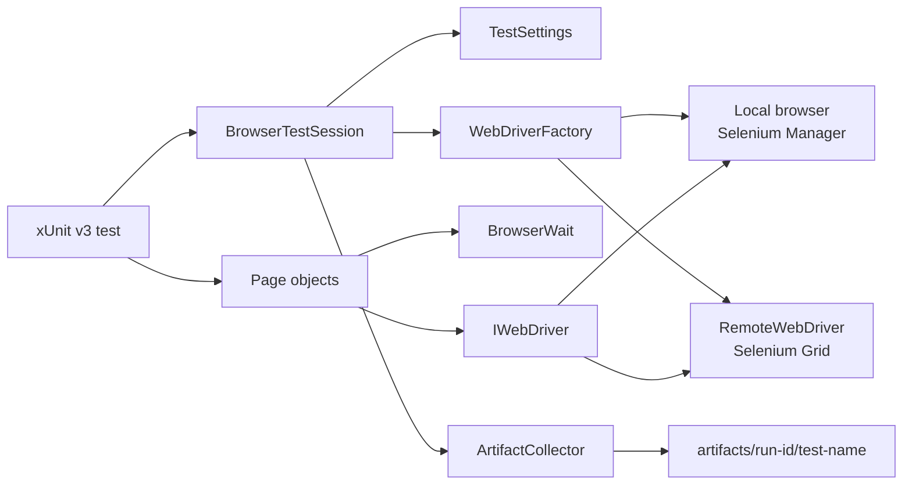
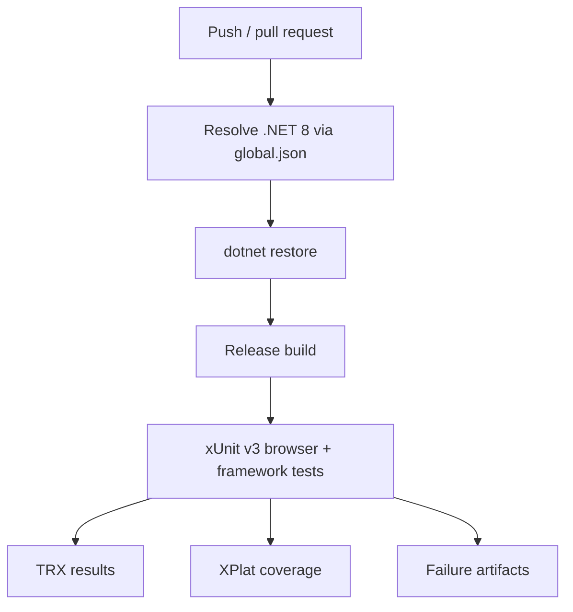

# .NET / Selenium UI Automation Framework

A C# UI automation framework built on xUnit v3 and Selenium WebDriver. The framework centralizes runtime validation, browser creation, explicit synchronization, failure evidence, and session lifecycle while keeping page objects focused on application behavior and preserving direct WebDriver semantics where they are clearest.

## Engineering contract

| Concern | Framework policy |
| --- | --- |
| Runtime configuration | Environment values are parsed into immutable `TestSettings` and rejected early when invalid. Contract tests inject a variable lookup instead of mutating process-global environment state. |
| Browser creation | Every browser session is created through `WebDriverFactory`; local Selenium Manager and remote Grid are supported. |
| Synchronization | Implicit wait is always zero. Bounded explicit waits are used only for observable readiness/clickability/URL state. |
| Test isolation | One xUnit test instance owns one browser session; no shared mutable WebDriver or test-owned process-environment mutation. |
| Failure evidence | Screenshot, page source, and current URL are captured before teardown; capture failures cannot replace the original test failure. |
| Cleanup | Driver quit/dispose is deterministic and cleanup errors are diagnostic rather than assertion replacements. |
| Toolchain | `global.json` keeps SDK selection on the .NET 8 feature band; xUnit v3 and its Visual Studio adapter are versioned explicitly. |
| Cross-browser policy | Chrome, Firefox, and Edge share one factory; CI uses a fast Chrome gate while broader coverage remains configuration-driven. |
| CI | Restore, Release build, tests, TRX, coverage, and browser artifacts execute with read-only repository permissions. |

## Architecture



The dependency direction matters: tests use application-level page operations; page objects receive an already configured driver; the driver factory owns browser policy; synchronization is explicit and narrow; diagnostics sit at the test-session boundary.

## Repository layout

```text
.
├── Framework/
│   ├── Configuration/
│   │   └── TestSettings.cs
│   ├── Diagnostics/
│   │   └── ArtifactCollector.cs
│   ├── Drivers/
│   │   └── WebDriverFactory.cs
│   ├── Execution/
│   │   └── BrowserTestSession.cs
│   └── Synchronization/
│       └── BrowserWait.cs
├── PageObjects/
│   ├── BasePage.cs
│   ├── LoginPage.cs
│   └── HomePage.cs
├── Tests/
│   ├── Framework/
│   └── LoginTests.cs
├── docs/
│   ├── ARCHITECTURE.md
│   └── TEST_STRATEGY.md
├── global.json
├── UiTests.csproj
└── .github/workflows/ci.yml
```

## Quick start

Prerequisites:

- a .NET 8 SDK compatible with `global.json`;
- a supported local Chrome, Firefox, or Edge installation, or access to a Selenium Grid.

```bash
dotnet restore UiTests.csproj
dotnet build UiTests.csproj --configuration Release
dotnet test UiTests.csproj --configuration Release --no-build
```

`global.json` anchors SDK selection to the .NET 8 `8.0.400` feature band and rolls forward only to its latest patch. This prevents a newer machine-wide SDK from silently changing the test-host behavior.

The xUnit v3 test project is executable as required by the v3 architecture. CI intentionally continues to invoke it through `dotnet test` and `xunit.runner.visualstudio` so TRX and Coverlet evidence remain part of the gate.

Run against Firefox:

```bash
TEST_BROWSER=firefox dotnet test UiTests.csproj
```

Run against a remote Grid:

```bash
TEST_BROWSER=chrome \
SELENIUM_GRID_URL=http://localhost:4444/wd/hub \
dotnet test UiTests.csproj
```

PowerShell equivalents use `$env:TEST_BROWSER = "firefox"` and `$env:SELENIUM_GRID_URL = "..."` before `dotnet test`.

## Runtime configuration

`Framework/Configuration/TestSettings.cs` is the only production environment parsing boundary.

| Variable | Purpose | Default |
| --- | --- | --- |
| `TEST_BASE_URL` | Application base URL used by page objects | `https://www.saucedemo.com` |
| `TEST_BROWSER` | `chrome`, `firefox`, or `edge` | `chrome` |
| `TEST_HEADLESS` | Headless browser execution | `true` |
| `TEST_EXPLICIT_WAIT_SECONDS` | Maximum explicit synchronization budget | `10` |
| `TEST_PAGE_LOAD_TIMEOUT_SECONDS` | WebDriver page-load timeout | `30` |
| `SELENIUM_GRID_URL` | Optional remote WebDriver endpoint | unset / local browser |
| `TEST_RUN_ID` | Artifact and diagnostic correlation identifier | generated GUID |

URLs must be absolute HTTP(S) values. Durations must be positive. Browser names are validated against an explicit allowlist. Invalid configuration is a framework error, not a test retry candidate.

`TestSettings.FromEnvironment()` reads the real process environment in production. The internal overload accepts a read-only variable lookup for framework-contract tests. This keeps parser coverage deterministic and parallel-safe without changing process-wide environment variables while other xUnit v3 tests are executing.

## Browser lifecycle

`BrowserTestSession` is the execution boundary for browser tests:

```csharp
using var session = new BrowserTestSession();
var login = new LoginPage(session.Driver, session.Settings);

session.Run("login-contract", () =>
{
    login.Navigate();
    login.Login("user", "credential");
    // assertions
});
```

The session guarantees that:

1. settings are validated before driver creation;
2. driver creation follows the configured local/Grid policy;
3. a thrown test exception triggers best-effort evidence capture before cleanup;
4. an artifact-capture failure is reported but does not mask the original exception;
5. WebDriver cleanup is attempted exactly once.

That ordering is intentional. The first failure is normally the most valuable diagnostic signal and must remain visible.

## Driver policy

`WebDriverFactory` owns all browser construction. It currently supports:

- Chrome / `ChromeDriver`;
- Firefox / `FirefoxDriver`;
- Edge / `EdgeDriver`;
- `RemoteWebDriver` when `SELENIUM_GRID_URL` is configured.

Common policy includes:

- implicit wait set to `TimeSpan.Zero`;
- configured page-load timeout;
- deterministic 1440×1000 viewport target;
- browser-specific headless flags;
- Selenium Manager for local driver resolution.

Tests must not construct a raw `ChromeDriver`, `FirefoxDriver`, or `RemoteWebDriver`. A second construction path creates configuration drift and makes CI/local behavior diverge.

## Synchronization model

`BrowserWait` contains the small set of synchronization primitives that genuinely benefit from central policy:

- element visible;
- element clickable;
- document ready state complete;
- URL starts with an expected absolute URI.

Polling is bounded and ignores only transient `NoSuchElementException` / `StaleElementReferenceException` cases while waiting. Normal interactions still use Selenium directly.

### Why implicit waits are disabled

Implicit waits modify every element lookup and interact poorly with explicit waits, making timing budgets hard to reason about. This framework keeps implicit wait at zero so each synchronization point has one visible upper bound.

Avoid:

```csharp
Thread.Sleep(2000);
driver.Manage().Timeouts().ImplicitWait = TimeSpan.FromSeconds(5);
```

Prefer an application-observable condition through `BrowserWait` or a page method that uses it.

## Page-object boundaries

Page objects should expose business intent and own stable locators. They should not become generic Selenium wrappers.

Good page API:

```csharp
loginPage.Login(username, password);
Assert.True(homePage.IsLoaded);
```

Avoid APIs such as:

```csharp
page.Click("#selector");
page.Type("#selector", value);
page.Wait(3000);
```

Those methods erase the application vocabulary without adding useful policy.

`BasePage` composes relative paths against the validated `TEST_BASE_URL`, allowing the same page objects to target another environment without hard-coded production-like URLs.

## Failure evidence

On a browser test exception, `ArtifactCollector` writes under:

```text
artifacts/<run-id>/<sanitized-test-name>/
├── failure.png
├── page-source.html
└── url.txt
```

Evidence is intentionally scoped to the failing browser state. It is not committed to source control and CI uploads it with bounded retention.

Automatic evidence should never include application credentials. When additional logging is added, keep authentication values, cookies, authorization headers, and sensitive page content out of general-purpose logs.

## CI topology



The workflow sets an explicit base URL, Chrome/headless policy, and a CI-derived run ID. Test evidence is uploaded even when the test command fails. The SDK pin and package versions make the test-host selection reviewable rather than dependent on whichever newer SDK happens to be installed on the runner.

## Failure triage

Classify a failure before changing test code:

| Signal | Likely class | First evidence |
| --- | --- | --- |
| Settings exception before browser launch | Configuration | workflow/env values |
| Driver cannot start | Browser/runner infrastructure | job log + browser installation |
| Page-load timeout | Environment/network/application readiness | URL + page source + runner connectivity |
| Explicit wait timeout | Selector/application state | screenshot + page source |
| Assertion failure after loaded state | Product behavior | assertion + screenshot |
| Artifact capture error | Secondary diagnostic degradation | stderr message; preserve original test exception |
| Driver cleanup error | Teardown/infrastructure | stderr; do not rewrite the test outcome |

Do not use a rerun to erase classification. A test that passes only after retry is a signal to investigate state leakage, environment saturation, synchronization, or an unstable dependency.

## Extension rules

When adding framework capability:

- add production environment parsing to `TestSettings`, not directly to tests;
- test configuration through the injected variable lookup instead of mutating process-global environment state;
- add browser creation behavior to `WebDriverFactory`;
- add synchronization only when there is a reusable observable condition;
- keep one browser session per test unless a measured performance constraint justifies a different lifecycle;
- use page objects for application intent, not Selenium API duplication;
- add framework tests for configuration and other non-browser infrastructure;
- capture diagnostics at the lifecycle boundary where failure context still exists;
- prefer an explicit Grid/browser matrix over conditional logic embedded in tests.

## Anti-patterns

The framework intentionally avoids:

- nonzero implicit waits;
- `Thread.Sleep` synchronization;
- raw driver construction inside test classes;
- static/shared WebDriver instances across parallel tests;
- process-wide environment mutation from parallel framework tests;
- assertions inside low-level driver helpers;
- catch-and-ignore exception handling around assertions;
- credentials embedded in page objects or committed fixtures;
- screenshot-only failure reporting with no URL/page-source context;
- generic wrappers that hide Selenium's native API without enforcing a real policy.

## Further design documentation

- [`docs/ARCHITECTURE.md`](docs/ARCHITECTURE.md) — component boundaries, driver policy, and dependency direction.
- [`docs/TEST_STRATEGY.md`](docs/TEST_STRATEGY.md) — browser coverage, reliability rules, and release-gate guidance.

The framework should remain easy to debug under failure. A readable page object, one explicit timing budget, one driver factory, deterministic configuration inputs, and evidence captured at the correct lifecycle boundary are more valuable than a large abstraction surface.
