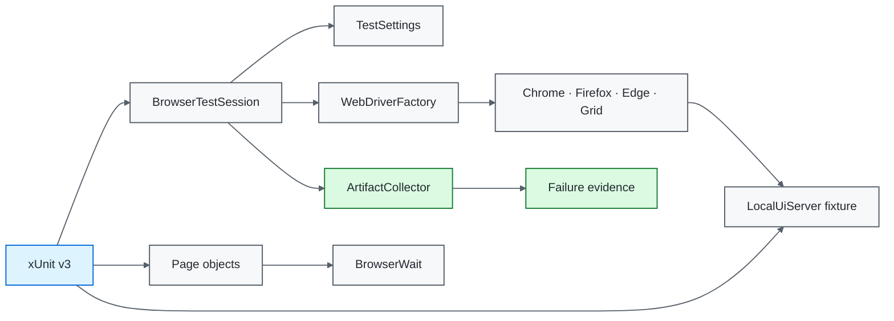

# .NET / Selenium Quality Engineering Framework

[](https://github.com/portyu9/qa-automation-dotnet-selenium/actions/workflows/ci.yml)
[](https://github.com/portyu9/qa-automation-dotnet-selenium/actions/workflows/extended.yml)
[](https://github.com/portyu9/qa-automation-dotnet-selenium/actions/workflows/security.yml)
[](https://github.com/portyu9/qa-automation-dotnet-selenium/actions/workflows/docs.yml)

[](https://dotnet.microsoft.com/)
[](https://xunit.net/)
[](https://www.selenium.dev/)
[](https://www.google.com/chrome/)
[](https://www.mozilla.org/firefox/)
[](https://github.com/features/actions)
[](https://trivy.dev/)
[](LICENSE)
[](.github/SECURITY.md)

A C# browser quality-engineering framework built on **xUnit v3, Selenium WebDriver, and .NET 8**. Configuration, browser construction, local application ownership, synchronization, evidence capture, and teardown each have one explicit owner while native WebDriver behavior remains visible for diagnosis.

> [!IMPORTANT]
> Required browser CI is independent of public demonstration sites. The default application is a repository-owned C# loopback fixture. Deployed applications and Selenium Grid are explicit execution choices—not hidden dependencies of framework correctness.

**Read by intent:** [capabilities](#capability-map) · [architecture](#architecture) · [quick start](#quick-start) · [lifecycle](#browser-lifecycle) · [synchronization](#synchronization-model) · [Grid](#grid-policy) · [dependencies](#dependency-maintenance) · [triage](#failure-triage)

## Capability map

| Plane | What it proves | Execution | Evidence |
| --- | --- | --- | --- |
| Framework contract | Configuration and artifact safety | xUnit v3 / .NET 8 | Assertions + coverage |
| Primary browser | Session + authentication behavior | Chrome + local fixture | TRX, Cobertura, browser artifacts |
| Extended browser | Engine compatibility | Chrome + Firefox + local fixture | Per-browser evidence |
| Remote execution | Driver-location portability | Optional Selenium Grid | Same page/test surface |
| Security | Dependency/configuration exposure | Trivy filesystem scan | JSON + Markdown findings |
| Documentation | README/workflow/governance consistency | Repository-local validator | Actions status |

## Architecture



## Engineering invariants

| Concern | Framework contract |
| --- | --- |
| Default target | `http://127.0.0.1:3200` is the deterministic application. |
| Fixture ownership | `LocalUiServer` is an xUnit collection fixture implemented in C#. |
| External integration | Non-default `TEST_BASE_URL` is explicit and separately attributable. |
| Configuration | `TestSettings` validates inputs before WebDriver creation. |
| Browser construction | `WebDriverFactory` is the single local/Grid construction boundary. |
| Synchronization | Implicit wait is zero; explicit waits observe visible/clickable/document/URL state. |
| Isolation | One xUnit test instance owns one WebDriver session. |
| Negative behavior | Authentication rejection is a required executable contract. |
| Evidence | Capture occurs before teardown without replacing the primary exception. |
| Artifact safety | Path material is constrained and diagnostic URLs are sanitized. |
| Reproducibility | .NET 8 is constrained by `global.json`; package versions are explicit. |

## Boundary decision guide

| Requirement | Preferred boundary |
| --- | --- |
| Settings/URL/token validation | Framework contract test |
| Browser construction/capabilities | `WebDriverFactory` contract |
| User-visible navigation/input | Selenium browser test |
| Readiness | `BrowserWait` observable condition |
| Browser compatibility | Extended Chrome/Firefox matrix |
| Remote location/capability negotiation | Grid run |
| Deployed application behavior | Explicit `TEST_BASE_URL` integration |

## Repository map

```text
.
├── Framework/
│   ├── Configuration/TestSettings.cs
│   ├── Diagnostics/ArtifactCollector.cs
│   ├── Drivers/WebDriverFactory.cs
│   ├── Execution/BrowserTestSession.cs
│   ├── Synchronization/BrowserWait.cs
│   └── Testing/LocalUiServer.cs
├── PageObjects/{BasePage.cs,LoginPage.cs,HomePage.cs}
├── Tests/{Fixtures,Framework}/
├── Tests/LoginTests.cs
├── docs/{ARCHITECTURE.md,TEST_STRATEGY.md}
├── .github/workflows/{ci,docs,extended,security}.yml
├── CONTRIBUTING.md
├── global.json
└── UiTests.csproj
```

## Quick start

```bash
dotnet restore UiTests.csproj
dotnet build UiTests.csproj --configuration Release
dotnet test UiTests.csproj --configuration Release --no-build
```

```bash
# Firefox compatibility
TEST_BROWSER=firefox dotnet test UiTests.csproj

# explicit deployed target
TEST_BASE_URL=https://test.example.internal TEST_BROWSER=chrome dotnet test UiTests.csproj

# Grid
TEST_BROWSER=chrome \
SELENIUM_GRID_URL=http://localhost:4444/wd/hub \
dotnet test UiTests.csproj
```

<details>
<summary><strong>Execution ownership</strong></summary>

- xUnit collection fixture owns the deterministic local application.
- each test instance owns exactly one browser session;
- `WebDriverFactory` owns browser/Grid construction;
- `BrowserWait` owns reusable synchronization policy;
- `ArtifactCollector` owns bounded failure evidence;
- `BrowserTestSession` preserves the causal exception through evidence and cleanup.

</details>

## Runtime configuration

| Variable | Purpose | Default |
| --- | --- | --- |
| `TEST_BASE_URL` | Browser application target | `http://127.0.0.1:3200` |
| `TEST_BROWSER` | `chrome`, `firefox`, or `edge` | `chrome` |
| `TEST_HEADLESS` | Browser headless mode | `true` |
| `TEST_EXPLICIT_WAIT_SECONDS` | Explicit wait budget | `10` |
| `TEST_PAGE_LOAD_TIMEOUT_SECONDS` | Page-load budget | `30` |
| `SELENIUM_GRID_URL` | Optional remote WebDriver endpoint | unset |
| `TEST_RUN_ID` | Run/artifact correlation | generated GUID |

HTTP(S) URLs must be absolute and may not contain credentials, query strings, or fragments. Browser names are allowlisted; duration budgets must be positive; supplied run IDs must satisfy the bounded correlation-token contract.

## Deterministic application fixture

`Framework/Testing/LocalUiServer.cs` provides `/health`, `/`, and `/inventory.html` using .NET networking primitives only. It proves real navigation, DOM interaction, JavaScript form behavior, URL transition, accepted authentication, and rejection behavior without public DNS, TLS, accounts, rate limits, or third-party uptime.

The fixture is intentionally small. It is an executable browser contract, not a general-purpose application framework.

## Browser lifecycle


Evidence or teardown failure is secondary diagnostic information. It must not replace the exception that caused the test to fail.

## Driver and synchronization policy

`WebDriverFactory` supports Chrome, Firefox, Edge, and optional `RemoteWebDriver`. Tests do not construct drivers directly because multiple construction paths cause capability, timeout, headless, and Grid behavior to drift.

`BrowserWait` centralizes visible/clickable/document/URL conditions. Implicit wait remains zero.

```csharp
Wait.UntilVisible(By.Id("inventory_container"));
```

> [!WARNING]
> `Thread.Sleep` is elapsed time, not readiness. Mixing non-zero implicit waits with explicit waits also creates hard-to-reason timeout multiplication.

## Page objects and evidence

Page objects own feature-specific selectors and operations; they do not rename every Selenium method. Native `IWebDriver`, `By`, and Selenium exceptions remain visible where they are the clearest diagnostic surface.

Failure artifacts use bounded run/test paths. Diagnostic URLs strip credentials, query strings, and fragments. Screenshots/page source can still contain application-visible data, so synthetic data and retention policy remain necessary.

## Grid policy

Grid changes **where** browser commands execute, not test architecture. Page/test code should not branch merely because a session is remote. Grid availability and capability negotiation are separate failure domains from application behavior.

## CI and governance

Primary CI builds and runs headless Chrome against the local fixture with TRX and coverage. Extended CI runs Chrome/Firefox independently. Security and docs workflows remain separate gates with their own evidence.

A deployed-environment run should add a new integration signal rather than replacing deterministic browser CI.

## Dependency maintenance

Dependabot maintains **NuGet** and **GitHub Actions**.

- weekly Monday 09:00 America/New_York;
- routine minor/patch updates grouped for review efficiency;
- major Selenium/xUnit/.NET ecosystem updates isolated as standalone PRs;
- Actions reviewed as executable dependencies;
- dependency PRs must clear build, browser, compatibility, security, and docs gates before merge.

Package automation, `global.json`, explicit package versions, and Trivy each address different supply-chain risks.

## Failure triage

| Signal | First interpretation |
| --- | --- |
| Configuration contract | Framework input policy |
| Fixture startup | Repository application lifecycle/port ownership |
| Driver creation | Browser/Selenium Manager/Grid runtime |
| Explicit-wait timeout | Expected observable state absent |
| Authentication mismatch | Application rejection/error semantics |
| Assertion | Browser-visible contract |
| Evidence failure | Secondary diagnostics |
| Teardown failure | Session/infrastructure cleanup |
| Browser-only failure | Compatibility |
| External-target-only failure | Environment/integration first |

## Explicit anti-patterns

- required CI against a public demo site;
- direct driver construction in tests;
- shared/static WebDriver state;
- `Thread.Sleep` readiness;
- mixed implicit/explicit waits;
- evidence exceptions masking causal failures;
- process-global environment mutation in parallel-safe configuration tests;
- credential/query-token persistence in generic diagnostics;
- browser-matrix expansion without compatibility risk.

## Design references

- [`docs/ARCHITECTURE.md`](docs/ARCHITECTURE.md) — settings, fixture, driver, session, page, synchronization, and evidence boundaries.
- [`docs/TEST_STRATEGY.md`](docs/TEST_STRATEGY.md) — layer selection, deterministic targets, browser matrix, negative testing, and exit criteria.
- [`CONTRIBUTING.md`](CONTRIBUTING.md) — change-quality expectations.

A strong Selenium framework makes the failing boundary obvious: **configuration, fixture lifecycle, browser construction, synchronization, application behavior, evidence, Grid transport, or deployed environment**.
