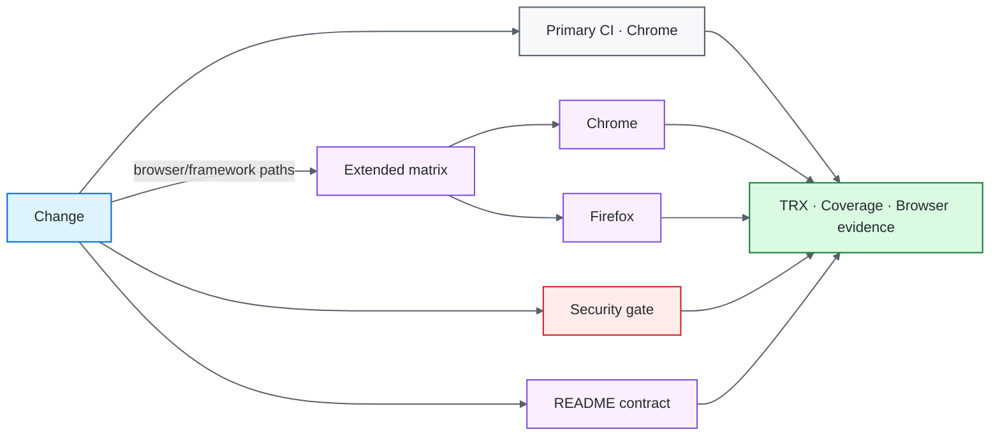
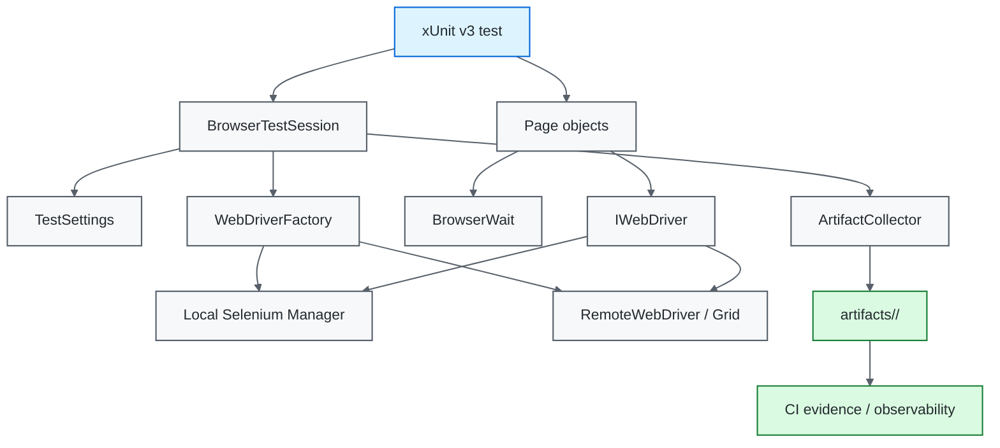
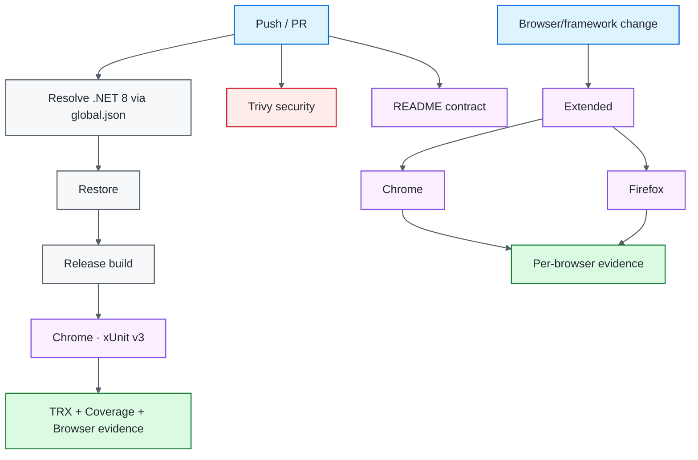

# .NET / Selenium Quality Engineering Framework

[](https://github.com/portyu9/qa-automation-dotnet-selenium/actions/workflows/ci.yml)
[](https://github.com/portyu9/qa-automation-dotnet-selenium/actions/workflows/extended.yml)
[](https://github.com/portyu9/qa-automation-dotnet-selenium/actions/workflows/security.yml)
[](https://github.com/portyu9/qa-automation-dotnet-selenium/actions/workflows/docs.yml)

[](https://dotnet.microsoft.com/)
[](https://xunit.net/)
[](https://www.selenium.dev/)
[](https://www.google.com/chrome/)
[](https://www.mozilla.org/firefox/)
[](https://github.com/features/actions)
[](https://trivy.dev/)
[](LICENSE)
[](.github/SECURITY.md)

A C# browser quality-engineering framework built on **xUnit v3**, **Selenium WebDriver**, and a deterministically selected .NET 8 SDK. Runtime configuration, browser construction, synchronization, failure evidence, and teardown are explicit framework boundaries; page objects remain focused on application behavior and native WebDriver semantics remain visible where they are already the clearest abstraction.

> [!IMPORTANT]
> The framework treats a browser test as a managed execution session, not a script with assertions. Configuration must be valid before a driver exists, waits must observe state rather than time, evidence must be captured before teardown, and diagnostic failures must never replace the original test failure.

## Capability map

| Validation plane | Purpose | Execution policy | Evidence |
| --- | --- | --- | --- |
| Primary CI | Framework contracts + real browser flow | .NET 8, xUnit v3, Chrome | TRX, Cobertura, browser artifacts |
| Extended browser | Browser compatibility | Chrome + Firefox on Linux | Per-browser TRX, coverage, artifacts |
| Local/Grid | Driver-location portability | Chrome / Firefox / Edge / RemoteWebDriver | Same test/page surface |
| Security | Dependency and repository-configuration risk | Pinned Trivy filesystem scan | JSON findings + Markdown summary |
| Documentation contract | README links, workflow badges, Mermaid declarations, governance surfaces, badge palette | Python stdlib validator | Actions status |
| Observability | Run identity and gate state | Structured CI envelope + run correlation | `artifacts/ci/observability.json`, Actions summary |



The normal pull-request lane stays intentionally narrow for feedback speed. Browser multiplication is a separate risk-based gate instead of a permanent multiplier on every change; documentation and security stay independent so their failures cannot be misclassified as browser behavior.

## Engineering invariants

| Concern | Framework contract |
| --- | --- |
| Runtime inputs | `TestSettings` validates and normalizes all environment-derived values before WebDriver creation. |
| Configuration testing | Contract tests inject a read-only variable lookup; they never mutate process-global environment state. |
| Correlation | `TEST_RUN_ID` is a bounded ASCII token; unsafe path-like values fail before driver creation. |
| Browser construction | `WebDriverFactory` is the only driver-construction boundary. |
| Toolchain | `global.json` anchors SDK selection to the .NET 8 feature band; package versions are explicit. |
| Synchronization | Implicit wait is zero; bounded explicit waits observe visibility, clickability, document, or URL state. |
| Isolation | One xUnit test instance owns one browser session; no static/shared driver state. |
| Failure evidence | Screenshot, page source, and sanitized URL are captured before teardown on failure. |
| Artifact containment | Run/test identifiers are sanitized and the resolved evidence path is verified to remain inside its configured root. |
| Exception integrity | Evidence/cleanup failures are secondary diagnostics and cannot mask the primary test exception. |
| Cross-browser | Chrome, Firefox, and Edge share one factory; CI matrix breadth is a policy choice, not test-code branching. |
| Documentation | README-local references, workflow badges, Mermaid roots, governance files, and static badge-color uniqueness are executable contracts. |

## Tool ownership model

| Tool / technology | Native responsibility | Framework responsibility | Deliberately left visible |
| --- | --- | --- | --- |
| xUnit v3 | Test discovery, instance lifecycle, parallel scheduling, assertions, failure reporting | Browser-session fixture pattern, injected configuration tests, framework contracts | Native test identity, exception/stack semantics, xUnit concurrency model |
| Selenium WebDriver | Browser protocol, driver commands, element interaction, navigation | Single driver factory, local/Grid selection, browser options, deterministic teardown | `IWebDriver`, `By`, native driver exceptions, protocol behavior |
| Selenium Manager | Local driver/browser resolution | Used only through the local factory path | Resolution failures remain Selenium/runtime failures rather than framework retries |
| `WebDriverWait` | Polling a condition until success/timeout | Reusable observable wait policies with zero implicit wait | The actual predicate and timeout failure remain inspectable |
| Chrome / Firefox / Edge | Browser-engine behavior | Matrix policy and consistent capabilities | Engine-specific rendering/input/navigation differences |
| RemoteWebDriver / Grid | Remote session negotiation and command transport | Optional endpoint configuration and the same page/test surface | Grid availability/capability negotiation remains a distinct failure domain |
| .NET SDK / NuGet | Compilation, restore, runtime host, dependency graph | `global.json`, explicit packages, release-build/test commands | Compiler/restore diagnostics are not wrapped into browser errors |
| Trivy | Filesystem vulnerability and supported misconfiguration analysis | Blocking severity policy and retained findings | The configured gate is not generic credential/secret scanning |
| GitHub Actions | Job/matrix scheduling and artifacts | Primary/extended/security/docs failure-domain separation and run correlation | Native job/process status remains authoritative |

## Architecture



The architecture keeps policy close to the concern that owns it. Browser options belong in the factory, readiness belongs in explicit synchronization, feature locators belong in page objects, and failure evidence belongs at the session boundary where the browser is still alive.

## Repository map

```text
.
├── Framework/
│   ├── Configuration/TestSettings.cs
│   ├── Diagnostics/ArtifactCollector.cs
│   ├── Drivers/WebDriverFactory.cs
│   ├── Execution/BrowserTestSession.cs
│   └── Synchronization/BrowserWait.cs
├── PageObjects/
├── Tests/
│   └── Framework/
├── docs/
│   ├── ARCHITECTURE.md
│   └── TEST_STRATEGY.md
├── .github/
│   ├── scripts/
│   │   └── validate_readme.py
│   └── workflows/
│       ├── ci.yml
│       ├── docs.yml
│       ├── extended.yml
│       └── security.yml
├── global.json
└── UiTests.csproj
```

## Documentation contract

`.github/workflows/docs.yml` runs a standard-library repository validator on every pull request and `main`. It checks deterministic local facts: Markdown targets stay inside the repository and exist, workflow badges map to committed workflow files, Mermaid blocks have a recognized diagram declaration, `LICENSE` and `.github/SECURITY.md` remain present, static Shields colors are unique within this README, and Security Policy remains GitHub-dark `#24292F`.

External URL availability is intentionally not part of this gate; an upstream website outage is not a .NET/Selenium framework defect.

## Quick start

Prerequisites:

- a .NET 8 SDK compatible with `global.json`;
- Chrome, Firefox, or Edge locally, or a reachable Selenium Grid.

```bash
dotnet restore UiTests.csproj
dotnet build UiTests.csproj --configuration Release
dotnet test UiTests.csproj --configuration Release --no-build
```

Run Firefox:

```bash
TEST_BROWSER=firefox dotnet test UiTests.csproj
```

Run through Grid:

```bash
TEST_BROWSER=chrome \
SELENIUM_GRID_URL=http://localhost:4444/wd/hub \
dotnet test UiTests.csproj
```

> [!NOTE]
> `global.json` is part of the framework contract. It prevents a newer machine-wide SDK from silently changing test-host behavior while the project itself still targets `net8.0`.

<details>
<summary><strong>Execution and evidence commands</strong></summary>

```bash
# Restore and compile once
dotnet restore UiTests.csproj
dotnet build UiTests.csproj --configuration Release --no-restore

# Documentation contract
python .github/scripts/validate_readme.py

# CI-equivalent VSTest path with TRX + coverage
dotnet test UiTests.csproj \
  --configuration Release \
  --no-build \
  --logger "trx;LogFileName=tests.trx" \
  --results-directory TestResults \
  --collect "XPlat Code Coverage"

# Alternate browser
TEST_BROWSER=firefox dotnet test UiTests.csproj
```

xUnit v3 is used as the test framework. The Visual Studio adapter remains deliberate because the CI evidence contract uses `dotnet test`, TRX, and Coverlet-compatible collection.

</details>

## Runtime configuration

`Framework/Configuration/TestSettings.cs` is the only production environment-parsing boundary.

| Variable | Purpose | Default |
| --- | --- | --- |
| `TEST_BASE_URL` | Application base URL | `https://www.saucedemo.com` |
| `TEST_BROWSER` | `chrome`, `firefox`, or `edge` | `chrome` |
| `TEST_HEADLESS` | Browser headless mode | `true` |
| `TEST_EXPLICIT_WAIT_SECONDS` | Explicit synchronization budget | `10` |
| `TEST_PAGE_LOAD_TIMEOUT_SECONDS` | Page-load budget | `30` |
| `SELENIUM_GRID_URL` | Optional remote WebDriver endpoint | unset |
| `TEST_RUN_ID` | Diagnostic/artifact correlation | generated GUID |

HTTP(S) URLs must be absolute and may not contain user-info, query strings, or fragments. Browser names are allowlisted, durations must be positive, and a supplied run ID must match the bounded correlation-token contract.

### Parallel-safe configuration contracts

Production calls `TestSettings.FromEnvironment()`. Framework tests use the internal overload that accepts a value lookup. This distinction matters: xUnit v3 may execute tests concurrently, so changing `Environment.SetEnvironmentVariable` inside a configuration-negative test would create process-wide state leakage into a real browser test. The injected lookup proves the parser without modifying global process state.

## Browser lifecycle

`BrowserTestSession` owns the complete browser lifetime:

```csharp
using var session = new BrowserTestSession();
var login = new LoginPage(session.Driver, session.Settings);

session.Run("login-contract", () =>
{
    login.Navigate();
    login.Login("user", "credential");
    // assertions
});
```

Lifecycle order:

1. validate settings;
2. create exactly one driver through `WebDriverFactory`;
3. execute the test body;
4. on failure, attempt evidence capture while the browser still exists;
5. preserve/rethrow the original exception;
6. quit and dispose exactly once;
7. treat cleanup failure as diagnostic information.

> [!WARNING]
> A screenshot exception, stale page-source call, or driver shutdown problem must not rewrite the primary assertion/browser failure. The first causal failure is the most valuable signal.

## Driver policy

`WebDriverFactory` supports:

- `ChromeDriver`;
- `FirefoxDriver`;
- `EdgeDriver`;
- `RemoteWebDriver` for Grid execution.

Common policy includes zero implicit wait, configured page-load timeout, deterministic viewport sizing, headless flags, and Selenium Manager for local driver resolution.

Tests must not instantiate drivers directly. A second construction path creates configuration drift and makes local/Grid/CI behavior diverge.

## Synchronization model

`BrowserWait` centralizes only synchronization that enforces a genuine policy:

- visible element;
- clickable element;
- complete document state;
- URL transition/readiness.

```csharp
Wait.UntilVisible(By.Id("inventory_container"));
```

Avoid:

```csharp
Thread.Sleep(2000);
driver.Manage().Timeouts().ImplicitWait = TimeSpan.FromSeconds(5);
```

A fixed delay only states how long the test waited. An explicit condition states what became true—or what failed to become true within a bounded budget.

## Page-object boundary

Page objects model feature language and stable state:

```csharp
loginPage.Login(username, password);
Assert.True(homePage.IsLoaded);
```

They should not become a generic WebDriver façade such as `Click(selector)` / `Type(selector, value)` / `Wait(milliseconds)`. Native Selenium remains visible unless a framework helper enforces a durable policy.

## Cross-browser strategy

Primary CI runs Chrome. `extended.yml` runs the complete xUnit v3 suite in Chrome and Firefox on Linux, each with independent TRX, coverage, run ID, and failure evidence.

Edge remains a first-class factory option for local/Windows/Grid validation, but it is intentionally not claimed as part of the Linux extended matrix.

Cross-browser expansion is valuable when the risk is browser-specific: rendering, input, navigation, browser APIs, or driver behavior. It is not a reason to repeat every data permutation in every browser.

## Security engineering

`.github/workflows/security.yml` uses the open-source Trivy filesystem scanner. The GitHub Action is pinned to immutable commit `ed142fd0673e97e23eac54620cfb913e5ce36c25` (`v0.36.0`) and explicitly installs Trivy `v0.74.0`.

The blocking policy covers:

- fixed HIGH/CRITICAL dependency vulnerabilities;
- HIGH/CRITICAL supported repository/configuration misconfigurations.

`ignore-unfixed: true` keeps the gate focused on findings with an available remediation path. JSON evidence is retained under `reports/security/` with a compact Markdown summary. The configured scanners are `vuln,misconfig`; this repository does not claim that workflow as generic credential/secret scanning.

Security findings are their own CI failure domain. Do not change browser assertions or retry policy to make a dependency/configuration finding disappear.

## Evidence and observability

### Failure evidence

```text
artifacts/<run-id>/<test>/
├── failure.png
├── page-source.html
└── url.txt
```

Persisted URLs are sanitized to remove user-info, query strings, and fragments while preserving origin/path for diagnosis. Run/test identifiers are additionally sanitized as path segments and the final directory is containment-checked against the configured artifact root. Screenshot and page source content can still contain application-visible values, so test data should be synthetic and non-sensitive.

### CI observability envelope

Primary CI writes:

```text
artifacts/ci/
├── observability.json
└── summary.md
```

`observability.json` is a small vendor-neutral record containing schema version, framework identity, run ID, runtime dimension, final status, commit SHA, and ref. It is intentionally easy to ingest into later open-source log/telemetry pipelines without making test execution depend on a backend.

### Correlation model

```text
GitHub Actions run
└── TEST_RUN_ID
    ├── xUnit test
    ├── artifacts/<run>/<test>
    └── CI observability envelope
```

## CI topology



## Failure triage

| Signal | Boundary | First action |
| --- | --- | --- |
| `TestSettings` exception | Runtime configuration | Correct the invalid value before browser debugging |
| SDK/restore/build failure | Toolchain/dependency | Verify `global.json`, package graph, compiler output |
| README contract | Documentation/governance | Fix local reference, workflow badge, Mermaid declaration, governance surface, or palette collision |
| Driver startup failure | Browser/runtime | Inspect Selenium Manager, browser installation, Grid reachability |
| Page-load timeout | Environment/application | Inspect target reachability and browser evidence |
| Explicit wait timeout | UI state/selector | Inspect screenshot, DOM/page source, URL |
| Assertion failure | Product/test expectation | Preserve assertion and inspect state evidence |
| Chrome passes, Firefox fails | Browser compatibility | Compare engine-specific behavior before weakening shared logic |
| Trivy failure | Dependency/configuration risk | Triage the JSON finding/remediation |
| Evidence capture failure | Diagnostics | Preserve original test failure and fix evidence path separately |
| Retry-only pass | Nondeterminism | Investigate state leakage, load, timing, shared account/data |

## Extension rules

When extending the framework:

1. add external configuration to `TestSettings` and test it through the injected lookup;
2. keep all browser construction in `WebDriverFactory`;
3. add synchronization only for reusable observable conditions;
4. preserve one driver per test unless measured evidence justifies another lifecycle;
5. keep page objects feature-oriented;
6. preserve primary exception identity through diagnostics and teardown;
7. keep artifact paths inside the configured root even when identifiers are adversarial;
8. expand browser matrices only for browser risk;
9. keep diagnostics bounded and privacy-aware;
10. preserve deterministic SDK/package selection;
11. keep security findings independent from behavioral-test tuning;
12. update README contracts whenever a public command, workflow, tool responsibility, or evidence surface changes.

## Explicit anti-patterns

- nonzero implicit waits;
- `Thread.Sleep` as synchronization;
- driver construction inside tests;
- static/shared `IWebDriver`;
- process-global environment mutation from parallel tests;
- path-like unvalidated correlation identifiers;
- catch-and-ignore around assertions;
- credentials in URLs/page objects;
- screenshot-only diagnosis without URL/page state;
- retries used as the definition of correctness;
- generic wrappers that hide Selenium without enforcing policy;
- README claims or badge surfaces not backed by committed repository state.

## Design references

- [`docs/ARCHITECTURE.md`](docs/ARCHITECTURE.md) — component, driver, lifecycle, and evidence boundaries.
- [`docs/TEST_STRATEGY.md`](docs/TEST_STRATEGY.md) — browser coverage, reliability, isolation, and gate policy.

> [!TIP]
> A mature browser framework is not measured by abstraction count. It is measured by how quickly a failed test can be classified, reproduced, and explained without changing the test simply to obtain a different result.
