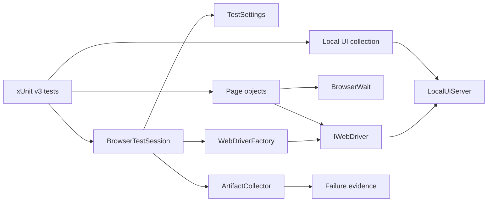

# Architecture

## Design objective

The UI framework separates user-flow intent from execution policy. Tests compose page objects; framework services own configuration, deterministic target lifecycle, driver creation, synchronization, evidence capture, and teardown.

The default required path is fully repository-owned: .NET hosts the local fixture, xUnit owns its lifetime, Selenium owns browser automation, and no public application is needed to determine framework health.

## Runtime and test-host contract

The project targets .NET 8 and uses xUnit v3. `global.json` constrains SDK selection so a newer machine-wide SDK cannot silently alter build/test-host behavior. The CI evidence contract remains `dotnet test` with TRX and XPlat coverage.

Test framework, adapter, SDK selection, fixture lifecycle, browser runtime, and evidence collection are reviewed as one execution contract.

## Configuration boundary

`TestSettings.FromEnvironment()` converts process inputs into immutable typed state before driver creation. The default `TEST_BASE_URL` is `http://127.0.0.1:3200`.

A non-default base URL explicitly selects a deployed application. `SELENIUM_GRID_URL` independently selects remote browser transport. Both URL inputs must be safe absolute HTTP(S) URIs without user-info, query strings, or fragments.

Configuration-contract tests inject a read-only variable lookup instead of mutating process-global environment variables, preserving parallel safety.

## Deterministic target boundary

`Framework/Testing/LocalUiServer.cs` is a minimal loopback HTTP fixture implemented with .NET networking primitives. It provides only the routes and client behavior needed for browser-framework contracts:

- `/health`;
- `/` authentication form;
- `/inventory.html` authenticated state.

`Tests/Fixtures/LocalUiCollection.cs` binds the fixture to xUnit collection lifecycle. The browser test constructor receives the fixture before creating the browser session, making target readiness a dependency of test construction rather than an external assumption.

The fixture deliberately excludes public DNS, TLS, external accounts, remote APIs, rate limits, and third-party page changes. Those concerns belong to an explicit environment-integration layer.

## Driver lifecycle

`WebDriverFactory` is the only browser construction boundary. Selenium Manager supplies local resolution; optional `RemoteWebDriver` uses the same test/page surface for Grid.

The factory enforces zero implicit wait, bounded page-load timeout, deterministic viewport, supported browser selection, and headless policy.

`BrowserTestSession` owns one driver for one xUnit test instance:

1. consume validated settings;
2. create the driver through the factory;
3. execute a named test body;
4. attempt evidence capture if the body fails;
5. preserve/rethrow the original exception;
6. quit and dispose exactly once.

Evidence and cleanup errors remain secondary diagnostics.

## Synchronization model

Implicit wait remains zero. `BrowserWait` observes explicit conditions such as visibility, clickability, complete document state, and URL transition. Fixed sleeps and mixed implicit/explicit waits are prohibited.

A synchronization helper should identify the state that failed to appear, not merely how long the test waited.

## Page URL and page-object model

Page destinations derive from `TestSettings.BaseUrl`; page objects contain feature selectors/operations. This allows the same test code to run against the local fixture, a controlled deployment, or Grid-hosted browsers without hard-coded deployment URLs.

Page objects should not become a generic Selenium façade. `IWebDriver`, `By`, and native Selenium exceptions remain visible where useful.

## Authentication contract

The local application models both acceptance and rejection:

- valid synthetic credentials navigate to `/inventory.html`;
- invalid credentials remain on `/` and expose a stable error.

This ensures the browser gate proves more than successful navigation and gives negative behavior an executable contract.

## Diagnostic evidence

`ArtifactCollector` stores browser evidence under run/test-specific directories while verifying path containment. Diagnostic URLs are sanitized before persistence by removing user-info, query strings, and fragments.

Screenshots/page source may contain visible application data and therefore require synthetic/controlled inputs and bounded retention.

## Parallelism and port ownership

Each test owns its WebDriver. The local fixture is shared only within the designated collection and binds loopback port `3200` once per test process.

Configuration tests do not mutate process environment. If future browser collections need simultaneous distinct application state, use isolated target instances/ports rather than shared mutable server state or globally disabling parallelism.

## External target and Grid model

There are three distinct concerns:

1. local fixture — required deterministic browser/framework verification;
2. deployed `TEST_BASE_URL` — explicit application/environment integration;
3. `SELENIUM_GRID_URL` — browser transport/location choice.

A Grid failure is not automatically an application failure, and a deployed environment outage is not a framework regression.

## CI boundary

Primary CI runs Chrome against the local fixture. Extended CI runs Chrome and Firefox against the same deterministic contract. Jobs have read-only repository permissions, superseded-run cancellation, explicit time bounds, run IDs, and retained evidence.

The primary job timeout is deliberate: a hung driver/session/server must terminate as infrastructure failure rather than consume runner capacity indefinitely.

## Extension rules

New framework behavior should:

1. validate configuration before browser side effects;
2. keep required CI target ownership inside the repository;
3. use native .NET/xUnit lifecycle for fixture behavior;
4. keep browser creation inside `WebDriverFactory`;
5. synchronize to observable state;
6. preserve one explicit session/evidence owner;
7. prevent diagnostic failures from masking primary failures;
8. add negative behavior where rejection semantics matter;
9. keep external deployment and Grid failures separately attributable;
10. add contract tests for new configuration, artifact, or lifecycle invariants.
