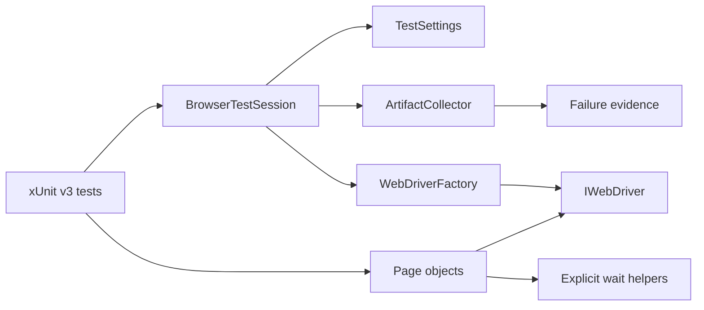

# Architecture

## Design objective

The UI framework keeps user-flow intent separate from browser/session policy. Tests compose page objects; framework services own configuration, driver creation, synchronization primitives, evidence capture, and deterministic teardown.



Tests must not instantiate `ChromeDriver`, `FirefoxDriver`, `EdgeDriver`, or `RemoteWebDriver` directly. `WebDriverFactory` is the single browser-construction boundary so local execution and Selenium Grid remain interchangeable.

## Runtime and test-host contract

The project targets .NET 8 and uses xUnit v3. `global.json` anchors SDK selection to the .NET 8 `8.0.400` feature band with latest-patch roll-forward. This is a framework invariant rather than a developer convenience: without an SDK constraint, a newer machine-wide SDK can silently change `dotnet test` and Microsoft.Testing.Platform behavior.

The xUnit v3 project is an executable test project. CI currently invokes it through `dotnet test` plus `xunit.runner.visualstudio` so TRX and Coverlet output remain part of the operational evidence model. Test framework, adapter, SDK selection, and evidence collection therefore evolve as one reviewed execution contract.

## Configuration boundary

`TestSettings.FromEnvironment()` converts process inputs into immutable typed state before browser creation.

Production configuration reads process environment variables through the public zero-argument entry point. The parser itself also accepts an internal read-only variable lookup. Framework-contract tests use that lookup instead of calling `Environment.SetEnvironmentVariable`, preventing process-global test state from racing with parallel browser-test construction.

`TEST_BASE_URL` and `SELENIUM_GRID_URL` must be absolute HTTP(S) URIs. Optional path prefixes are allowed; URL credentials, query strings, and fragments are rejected. Authentication belongs in an explicit browser/application authentication mechanism, not URL user-info.

Browser names are allowlisted. Wait/page-load budgets must be positive. Boolean parsing is explicit. A configuration error is therefore classified before WebDriver side effects begin.

## Driver lifecycle

`WebDriverFactory` owns browser-specific options and local/remote creation. Selenium Manager supplies local driver resolution; no manually pinned browser-driver binary is required.

The factory enforces:

- zero implicit wait;
- a bounded page-load timeout;
- deterministic viewport sizing;
- supported browser selection;
- optional Grid execution through the same test surface.

`BrowserTestSession` owns exactly one driver for one xUnit test instance. Its responsibilities are deliberately narrow:

1. load validated settings;
2. create the driver through the factory;
3. execute a named test body;
4. attempt failure evidence capture before cleanup;
5. rethrow the original test exception;
6. quit/dispose the driver deterministically.

Evidence capture is best-effort. If the browser is already unhealthy, a capture exception must never replace the original assertion/browser failure.

## Synchronization model

Implicit waits remain disabled. Page objects use explicit waits around observable conditions such as:

- element visibility;
- clickability;
- document readiness;
- page-specific loaded state.

Mixing implicit and explicit waits creates compounded, difficult-to-predict latency and is prohibited. Fixed sleeps are also not a synchronization primitive.

Page objects expose application-level operations rather than generic wrappers for every WebDriver method. Locators and waits remain close to the feature that owns them.

## Page URL model

Page objects derive destinations from the validated `TestSettings.BaseUrl` rather than hard-coded deployment URLs. This keeps the same flow portable across local, CI, and controlled environment targets while retaining one validation boundary.

## Diagnostic evidence

`ArtifactCollector` stores failure evidence under a run/test-specific directory:

```text
artifacts/<run-id>/<test>/
├── failure.png
├── page-source.html
└── url.txt
```

The persisted URL is sanitized before writing: HTTP(S) user-info, query strings, and fragments are removed while origin/path are retained. This prevents common token-in-URL patterns from entering CI artifacts.

Screenshots and page source may still contain application-visible synthetic data. Use safe test accounts/data and bounded artifact retention; URL sanitization is not a substitute for data minimization.

## Parallelism

Each test owns an isolated driver. Static/shared `IWebDriver` instances are prohibited. Mutable application data must also be isolated before browser concurrency is enabled.

Framework tests must not mutate process-global environment variables as temporary fixtures. Configuration contracts inject a variable lookup, which allows xUnit v3 parallelism to remain enabled without leaking one test's invalid configuration into another test's constructor.

If a specific account or environment cannot support concurrent access, isolate the affected test collection rather than globally disabling xUnit parallelism.

## Grid and browser expansion

Grid is a transport/location choice, not a second test architecture. New browser variants belong in `WebDriverFactory` and CI matrices only when compatibility risk justifies them. Page/test code should not branch on whether execution is local or remote.

## Extension rules

New framework behavior should satisfy all of the following:

- external configuration is validated before browser creation;
- configuration tests use injected reads, not process-wide mutation;
- browser construction stays inside `WebDriverFactory`;
- synchronization targets an observable state rather than elapsed time;
- a helper models application intent or cross-cutting policy rather than mirroring Selenium;
- driver/evidence lifecycle ownership is explicit;
- diagnostic output is bounded and privacy-aware;
- evidence failures cannot mask the original test failure;
- SDK/test-runner changes preserve a reproducible execution host;
- a framework-contract test verifies new configuration or diagnostic invariants.
