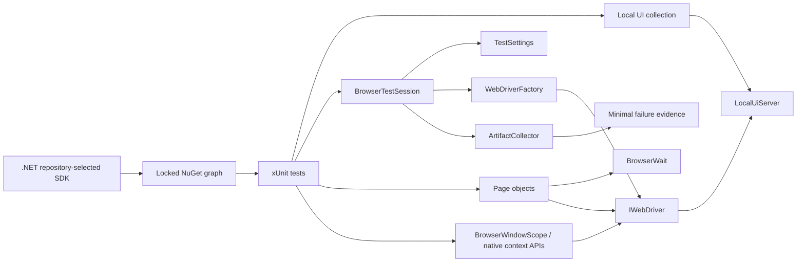

# Architecture

## Design objective

The UI framework separates user-flow intent from execution policy. Tests compose page objects and native browser primitives; framework services own runtime configuration, deterministic target lifecycle, driver creation, synchronization, child-window ownership, evidence capture, and teardown. Supply-chain policy is part of the execution architecture rather than a separate installation concern.

The required path is fully repository-owned: .NET hosts the local fixture, xUnit owns its lifetime, Selenium owns browser automation, and no public application is needed to determine framework health.

## Runtime and dependency contract

The project targets the configured target framework and uses xUnit. `global.json` selects repository-selected SDK with roll-forward disabled so local and CI execution use the same feature band rather than silently accepting an ambient SDK.

Dependency resolution is similarly explicit:

- direct package intent is declared in the project;
- the resolved graph is committed in `packages.lock.json`;
- required automation restores with `--locked-mode`;
- unexpected dependency-graph drift fails rather than rewriting the lock;
- NuGet Audit evaluates direct and transitive dependencies;
- HIGH/CRITICAL advisories (`NU1903`/`NU1904`) are build errors;
- compiler/analyzer warnings are errors.

SDK selection, dependency graph, test framework, adapter, fixture lifecycle, browser runtime, and evidence collection are reviewed as one execution contract.

## Configuration boundary

`TestSettings.FromEnvironment()` converts process inputs into immutable typed state before driver creation. The default `TEST_BASE_URL` is `http://127.0.0.1:3200`.

A non-default base URL explicitly selects a deployed application. `SELENIUM_GRID_URL` independently selects remote browser transport. Both URL inputs must be safe absolute HTTP(S) URIs with a hostname, no user-info/query/fragment, and no explicit port `0`.

Run IDs are bounded safe correlation tokens because they are reused for evidence paths and CI correlation. Configuration-contract tests inject a read-only variable lookup instead of mutating process-global environment variables, preserving parallel safety.

## Deterministic target boundary

`LocalUiServer` is a minimal loopback HTTP fixture implemented with .NET networking primitives. It provides deterministic routes for authentication and explicit browser-context capabilities, including frames, alerts, and a controlled child window.

The xUnit collection fixture starts the server before browser-test construction and disposes it after the collection. Target readiness is therefore a dependency of test construction rather than an external assumption.

Accepted TCP clients are tracked as owned tasks rather than fire-and-forget work. During disposal the fixture cancels the accept loop, stops the listener, waits for acceptance to finish, and drains the currently owned client tasks before releasing cancellation resources. Expected cancellation/transport teardown exceptions are handled only in the cancellation path; unrelated client faults are not silently converted to success.

This prevents collection teardown from completing while request work owned by the fixture is still running.

The fixture deliberately excludes public DNS, TLS, external accounts, remote APIs, rate limits, and third-party page changes. Those concerns belong to explicit environment integration.

## Driver lifecycle

`WebDriverFactory` is the only browser construction boundary. Selenium Manager supplies local resolution; optional `RemoteWebDriver` uses the same test/page surface for Grid.

The factory enforces:

- supported browser allowlisting;
- headless policy;
- zero implicit wait;
- bounded page-load timeout;
- deterministic viewport;
- one local/Grid construction path.

`BrowserTestSession` owns one driver for one xUnit test instance:

1. consume validated settings;
2. create the driver through the factory;
3. execute a named test body;
4. attempt minimal evidence capture if the body fails;
5. preserve/rethrow the original exception;
6. quit and dispose exactly once.

Evidence and cleanup errors remain secondary diagnostics.

## Explicit browser-context primitives

Framework capability tests intentionally keep Selenium APIs visible for behaviors that do not justify a page-object wrapper:

- `IJavaScriptExecutor` for an explicit JavaScript requirement;
- cookie creation/readback through `Manage().Cookies`;
- frame entry plus `SwitchTo().DefaultContent()` restoration;
- alert text assertion and acceptance;
- child-window creation/closure/restoration through `BrowserWindowScope`.

`BrowserWindowScope` owns the newly opened handle, uses bounded `WebDriverWait` polling rather than sleeps, closes only the child it owns, restores the originating window, and makes disposal idempotent. It is a lifecycle abstraction, not a replacement for Selenium's window API.

The Selenium Actions API should be added only when a product requirement depends on low-level keyboard, pointer, drag/drop, wheel, touch/pen, or related input semantics.

## Synchronization model

Implicit wait remains zero. `BrowserWait` observes explicit conditions such as visibility, clickability, complete document state, URL transition, alert/window availability, and application-specific state. Fixed sleeps and mixed implicit/explicit waits are prohibited.

A synchronization helper should identify the state that failed to appear, not merely how long the test waited.

## Page URL and page-object model

Page destinations derive from `TestSettings.BaseUrl`; page objects contain feature selectors and operations. The same test architecture can run against the local fixture, a controlled deployment, or Grid-hosted browsers without hard-coded deployment URLs.

Page objects should not become a generic Selenium façade. `IWebDriver`, `By`, and native Selenium exceptions remain visible where useful.

## Authentication contract

The local application models both acceptance and rejection:

- valid synthetic credentials navigate to the inventory surface;
- invalid credentials remain on the login surface and expose a stable error.

This ensures the browser gate proves more than successful navigation and gives negative behavior an executable contract.

## Diagnostic evidence

`ArtifactCollector` stores browser evidence under run/test-specific directories while verifying path containment before evidence is written. HTTP(S) diagnostic URLs retain only scheme/host/path context after user-info, query strings, and fragments are removed. Non-HTTP URLs are reduced to a scheme-only redacted sentinel; `about:blank` is preserved as a safe browser state.

The automatic failure contract is intentionally minimal:

- sanitized URL text;
- screenshot when the driver supports `ITakesScreenshot`.

Page source is **opt-in** and is not captured automatically. DOM source can contain hidden values, tokens, personal data, or other application content that is not visible in a screenshot. A caller that opts in must use synthetic/controlled data and an appropriate retention/access policy.

Screenshots can also contain visible application data and therefore still require controlled test inputs and bounded retention.

## Parallelism and port ownership

Each test owns its WebDriver. The local fixture is shared only within the designated collection and binds loopback port `3200` once per test process. The fixture owns both its listener/accept loop and accepted client tasks; collection disposal drains those tasks instead of leaving background request work behind.

Configuration tests do not mutate process environment. If future browser collections need simultaneous distinct application state, use isolated target instances/ports rather than shared mutable server state or globally disabling parallelism.

## External target and Grid model

There are three distinct concerns:

1. local fixture — required deterministic browser/framework verification;
2. deployed `TEST_BASE_URL` — explicit application/environment integration;
3. `SELENIUM_GRID_URL` — browser transport/location choice.

A Grid failure is not automatically an application failure, and a deployed environment outage is not a framework regression.

## Security architecture

Security controls remain layered and separately attributable:

### NuGet restore audit

The project explicitly audits the full package graph at HIGH severity. HIGH/CRITICAL advisories are errors during restore. Because restore is locked, an advisory fix cannot silently mutate the dependency graph; the PackageReference/lock change must be intentional and reviewed.

### CodeQL

The security workflow performs a manual C# CodeQL build using the same exact SDK, locked restore, and Release build contract as CI. `security-extended` queries cover source/data-flow issues that a package scanner cannot detect.

### Trivy

Trivy scans the repository filesystem for supported fixed HIGH/CRITICAL dependency findings, HIGH/CRITICAL supported misconfiguration, and committed secret material. Its JSON evidence is retained independently of CodeQL.

### Dependency Review

On pull requests, the workflow probes GitHub Dependency graph availability. If available, Dependency Review evaluates dependency changes at HIGH severity. If the graph service is unavailable, the workflow states that limitation and retains NuGet Audit + Trivy instead of claiming equivalent change-aware review.

### Dependabot and Actions

Dependabot maintains NuGet and GitHub Actions dependencies. Workflow actions are pinned by immutable commit SHA; version comments are readability metadata rather than the trust anchor.

## CI boundary

Primary CI uses repository-selected SDK, restores `packages.lock.json` in locked mode, audits HIGH/CRITICAL advisories, builds the configured target framework with warnings as errors, and runs Chrome against the repository-owned fixture. TRX, XPlat/Cobertura coverage, browser failure evidence, and a CI observability envelope are retained.

Extended CI applies the same restore/build policy to Chrome and Firefox independently. Jobs have read-only repository permissions, superseded-run cancellation, explicit time bounds, run IDs, and bounded evidence retention.

Security and docs workflows remain separately attributable gates. A hung driver/session/server must terminate as infrastructure failure rather than consume runner capacity indefinitely.

## Failure-domain separation

| Failure | First owner |
| --- | --- |
| SDK mismatch | Toolchain policy |
| Locked restore drift | Dependency reproducibility |
| `NU1903` / `NU1904` | Dependency advisory policy |
| Compiler/analyzer warning | Build quality |
| CodeQL | Source static security |
| Trivy | Repository dependency/configuration/secret security |
| Dependency Review | PR dependency delta |
| Missing/unsafe test target or Grid URL | Configuration |
| Local fixture startup/teardown | Deterministic target lifecycle |
| Driver creation | Browser/Selenium Manager/Grid runtime |
| Wait timeout | Observable-state contract |
| Context mismatch | Browser state ownership |
| Browser assertion | Application contract |
| Artifact failure | Secondary diagnostics |

## Extension rules

New framework behavior should:

1. preserve exact SDK and locked dependency reproducibility unless an intentional migration changes them;
2. keep HIGH/CRITICAL dependency audit fail-closed;
3. validate configuration before browser side effects;
4. reject unusable explicit target/Grid ports before session creation;
5. keep required CI target ownership inside the repository;
6. use native .NET/xUnit lifecycle for fixture behavior;
7. track and drain asynchronous work owned by fixtures before teardown completes;
8. keep browser creation inside `WebDriverFactory`;
9. synchronize to observable state;
10. preserve one explicit session/window/evidence owner;
11. keep automatic evidence minimal and require explicit opt-in for richer DOM data;
12. prevent diagnostic failures from masking primary failures;
13. add negative behavior where rejection semantics matter;
14. keep external deployment and Grid failures separately attributable;
15. add contract tests for new configuration, artifact, or lifecycle invariants.
