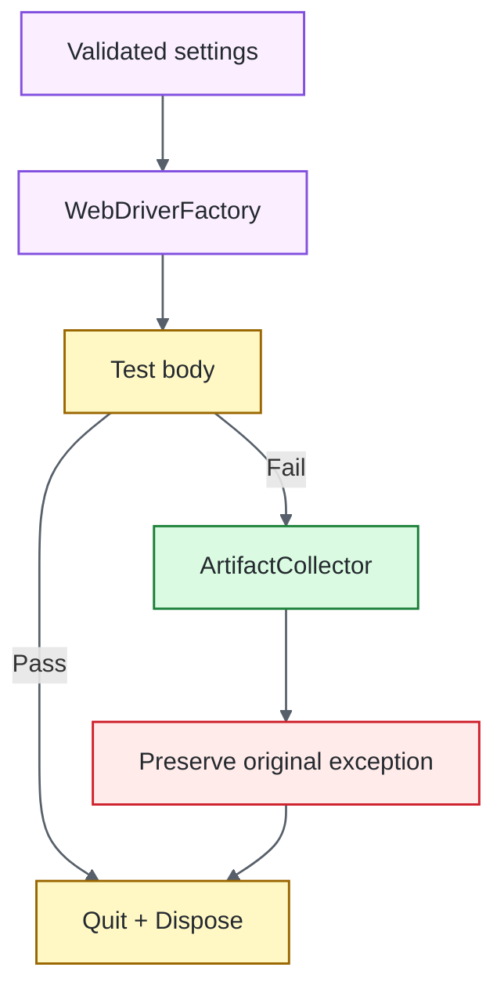

# Operations Guide

## Purpose

This guide owns the detailed operating contract for the .NET / Selenium Quality Engineering Framework: local execution, configuration, deterministic fixture lifecycle, browser/session/context ownership, synchronization, Grid policy, evidence, security, dependency maintenance, and failure triage.

The main [`README.md`](../README.md) is intentionally concise. Deep runtime and ownership design remains in [`ARCHITECTURE.md`](ARCHITECTURE.md), while risk-based browser strategy and exit criteria remain in [`TEST_STRATEGY.md`](TEST_STRATEGY.md).

## Quick commands

Prerequisites are the SDK selected by `global.json` and a supported local browser. Selenium Manager resolves compatible local WebDriver binaries.

```bash
# exact dependency graph + security audit
dotnet restore UiTests.csproj --locked-mode

# release build; warnings are errors
dotnet build UiTests.csproj --configuration Release --no-restore

# deterministic Chrome gate
dotnet test UiTests.csproj --configuration Release --no-build
```

Compatibility/integration examples:

```bash
# Firefox compatibility
TEST_BROWSER=firefox dotnet test UiTests.csproj

# explicit deployed target
TEST_BASE_URL=https://test.example.internal TEST_BROWSER=chrome dotnet test UiTests.csproj

# Selenium Grid
TEST_BROWSER=chrome \
SELENIUM_GRID_URL=http://localhost:4444/wd/hub \
dotnet test UiTests.csproj
```

## Runtime configuration

| Variable | Purpose | Default |
| --- | --- | --- |
| `TEST_BASE_URL` | Browser application target | `http://127.0.0.1:3200` |
| `TEST_BROWSER` | `chrome`, `firefox`, or `edge` | `chrome` |
| `TEST_HEADLESS` | Browser headless mode | `true` |
| `TEST_EXPLICIT_WAIT_SECONDS` | Explicit wait budget | `10` |
| `TEST_PAGE_LOAD_TIMEOUT_SECONDS` | Page-load budget | `30` |
| `SELENIUM_GRID_URL` | Optional remote WebDriver endpoint | unset |
| `TEST_RUN_ID` | Run/artifact correlation | generated GUID |

HTTP(S) URLs must be absolute and may not contain credentials, query strings, fragments, or explicit port `0`. Browser values are allowlisted; duration budgets must be positive; supplied run IDs must satisfy the bounded correlation-token contract.

`TestSettings.FromEnvironment()` converts external inputs into immutable typed state before driver creation. Configuration contract tests inject a read-only lookup rather than mutating process-global environment variables.

## Deterministic application fixture

`LocalUiServer` provides repository-owned authentication and browser-capability routes using .NET networking primitives. It supports navigation, DOM interaction, JavaScript, accepted/rejected authentication, frames, alerts, cookies, and popup/window transitions without public DNS, TLS, remote accounts, rate limits, or third-party uptime.

The xUnit collection fixture starts the application before browser-test construction and disposes it after the collection. Accepted TCP clients are tracked as owned tasks. Disposal stops/cancels acceptance, waits for the accept loop, and drains fixture-owned request work before resources are released.

A green collection therefore cannot leave fixture-owned work running in the background.

## Browser lifecycle



`BrowserTestSession` owns one driver for one xUnit test instance. It preserves the causal test exception through evidence capture and teardown; evidence/cleanup failures remain secondary diagnostics.

## Driver construction

`WebDriverFactory` is the single local/Grid construction boundary and owns:

- supported browser allowlisting;
- headless policy;
- zero implicit wait;
- bounded page-load timeout;
- deterministic viewport;
- Selenium Manager local resolution;
- optional `RemoteWebDriver` construction.

Tests should not construct drivers directly. Multiple creation paths lead to capability, timeout, headless, and Grid drift.

## Explicit browser-context primitives

The capability suite intentionally keeps Selenium's native APIs visible when their semantics matter:

- `IJavaScriptExecutor` for explicit script execution;
- cookies through `Manage().Cookies`;
- frame entry paired with `SwitchTo().DefaultContent()` restoration;
- alert text assertion and explicit acceptance;
- `BrowserWindowScope` for bounded child-window acquisition, owned closure, and origin-window restoration.

`BrowserWindowScope` closes only the child handle it owns, restores the originating window, uses bounded explicit polling rather than sleeps, and makes disposal idempotent.

Use the Selenium Actions API only when the product requirement depends on low-level keyboard, pointer, hover, drag/drop, wheel, touch/pen, or related semantics.

## Synchronization policy

Implicit wait is always zero. `BrowserWait` expresses readiness through observable state such as:

- visibility/clickability;
- complete document state;
- URL transition;
- alert/window availability;
- application-specific conditions.

`Thread.Sleep` and mixed implicit/explicit waits are prohibited. A timeout should identify which state failed to become true rather than merely how long the runner waited.

## Page objects

Page objects own feature-specific selectors and operations; they do not rename every Selenium method. Native `IWebDriver`, `By`, context APIs, and Selenium exceptions remain visible when they are the clearest diagnostic surface.

Page destinations derive from `TestSettings.BaseUrl`, allowing the same page/test model to target the local fixture, a controlled deployment, or Grid-hosted sessions without hard-coded deployment URLs.

## Authentication contract

The deterministic fixture proves both acceptance and rejection:

- valid synthetic credentials navigate to inventory;
- invalid credentials remain on login and expose a stable error.

Negative behavior is a required executable contract, not an incidental failure path.

## Evidence policy

`ArtifactCollector` writes under bounded run/test-specific paths after verifying path containment. Automatic failure evidence is intentionally minimal:

- sanitized current URL with credentials/query/fragment removed;
- screenshot when `ITakesScreenshot` is supported.

Page source is **not** captured automatically. `includePageSource: true` is an explicit data-handling decision because DOM source can contain hidden values, tokens, personal data, or application state that is not visible in screenshots.

Screenshots can also expose visible data, so controlled synthetic inputs and bounded artifact retention remain necessary.

## Grid policy

Grid changes where browser commands execute, not the test architecture. Page/test code should not branch just because a session is remote.

Three concerns stay separate:

1. local fixture — deterministic framework/browser health;
2. non-default `TEST_BASE_URL` — deployed application/environment integration;
3. `SELENIUM_GRID_URL` — browser transport/location.

A Grid availability/capability failure is not automatically an application defect, and a deployed-environment outage is not a framework regression.

## Supply chain and security

The repository deliberately layers controls:

1. `global.json` pins the repository-selected SDK with roll-forward disabled.
2. Explicit PackageReferences define direct intent.
3. `packages.lock.json` records the resolved graph.
4. Required automation restores with `--locked-mode`.
5. NuGet Audit evaluates direct/transitive packages at HIGH severity; `NU1903`/`NU1904` are errors.
6. `TreatWarningsAsErrors` makes compiler/analyzer warnings build-breaking.
7. CodeQL analyzes C# using `security-extended` after controlled restore/build.
8. Trivy independently scans repository dependency/configuration/secret risk.
9. Pull requests use Dependency Review when GitHub Dependency graph is available; unavailability is stated rather than represented as an equivalent whole-repository scan.
10. Dependabot maintains NuGet and Actions; workflow Actions remain immutable-SHA pinned.

Locked restore is reproducibility evidence, not a reason to ignore advisories. Security scanning does not prove browser compatibility; dependency changes still need browser evidence.

## CI and confidence boundaries

Primary CI restores the locked/audited graph, builds with warnings as errors, and runs headless Chrome against the repository fixture. Extended CI applies the same dependency/build policy to Chrome and Firefox independently.

| Signal | Confidence gained | Deliberate limit |
| --- | --- | --- |
| xUnit framework/config contracts | Driver/config/lifecycle/wait/evidence policy is deterministic | Does not prove browser rendering, Grid, or deployed infrastructure |
| Primary Selenium browser gate | Covered navigation/input/context/page-object behavior works in primary browser | Does not imply universal browser/device/OS/viewport/accessibility coverage |
| Alternate-browser lane | Covered flows survive an engine change with controlled app behavior | Selected coverage is not total browser equivalence |
| Repository fixture | WebDriver semantics execute without public-network noise | Does not prove deployed TLS, ingress, identity, data, or external services |
| Explicit waits | Failures identify missing observable state rather than elapsed-time guesses | A timeout cannot make the wrong readiness condition correct |
| Grid execution | Session creation can delegate to remote WebDriver with the same test model | Does not prove any Grid/provider capacity, image, network, or SLA |
| TRX/coverage/browser artifacts | Attributable execution/failure context is retained | Artifact presence alone is not proof of correct execution semantics |
| Locked NuGet + security controls | Reproducibility and independent dependency/source/repository/change-diff checks exist | Locked/green results are scoped evidence, not proof of vulnerability absence |

## Dependency maintenance

Dependabot maintains **NuGet** and **GitHub Actions** weekly.

- routine minor/patch updates may be grouped;
- major Selenium/xUnit/.NET ecosystem changes remain independently attributable;
- SDK changes require intentional `global.json` edits plus full browser/security qualification;
- lock changes must correspond to intentional PackageReference/resolution changes;
- dependency PRs must clear locked restore, NuGet Audit, build, Chrome, applicable Firefox, CodeQL/Trivy/Dependency Review, and docs gates.

## Failure triage

| Signal | First interpretation |
| --- | --- |
| SDK selection | Toolchain reproducibility |
| Locked restore | Dependency graph drift/incompatible lock |
| `NU1903` / `NU1904` | HIGH/CRITICAL NuGet advisory |
| Compiler/analyzer warning | Build-quality regression |
| CodeQL | C# security/data-flow finding |
| Trivy | Repository dependency/configuration/secret finding |
| Dependency Review | New PR dependency risk |
| Configuration | Framework input policy |
| Fixture startup/teardown | Repository target lifecycle/port/work ownership |
| Driver creation | Browser/Selenium Manager/Grid runtime |
| Explicit-wait timeout | Expected observable state absent |
| Frame/alert/window mismatch | Browser-context ownership/restoration |
| Authentication mismatch | Application rejection semantics |
| Assertion | Browser-visible contract |
| Evidence failure | Secondary diagnostics |
| Teardown failure | Session/infrastructure cleanup |
| Browser-only failure | Compatibility |
| External-target-only failure | Environment/integration first |

## Explicit anti-patterns

- required CI against a public demo site;
- unlocked restore in required automation;
- disabling NuGet Audit/warning policy merely to obtain green CI;
- direct driver construction in tests;
- shared/static WebDriver state;
- frame/window switching without restoration ownership;
- `Thread.Sleep` readiness;
- mixed implicit/explicit waits;
- automatic page-source retention without explicit data-handling review;
- evidence exceptions masking causal failures;
- process-global environment mutation in parallel-safe config tests;
- credential/query-token persistence in generic diagnostics;
- browser-matrix expansion without a compatibility risk.

## Related documentation

- [`ARCHITECTURE.md`](ARCHITECTURE.md) — runtime, supply chain, fixture, driver, session, synchronization, and evidence boundaries.
- [`TEST_STRATEGY.md`](TEST_STRATEGY.md) — deterministic targets, browser matrix, negative testing, security gates, and exit criteria.
- [`../CONTRIBUTING.md`](../CONTRIBUTING.md) — change-quality expectations.

A strong Selenium framework makes the failing boundary obvious: toolchain, dependency graph, security policy, configuration, fixture lifecycle, browser construction, browser-context ownership, synchronization, application behavior, evidence, Grid transport, or deployed environment.
